### Metody pro řešení soustavy lineárních rovnic


#### Gaussova metoda


```{r}
# Řeší soustavu Ax = b
gaussova_metoda <- function(A, b) {
  n <- nrow(A); Ab <- cbind(A, b)  # Rozšířená matice
  # Dopředná eliminace
  for (k in 1:(n-1)) {
    max_idx <- which.max(abs(Ab[k:n, k])) + k - 1 #Výběr pivota (částečná pivotace)
    if (max_idx != k) { # Prohození řádků
      temp <- Ab[k, ]
      Ab[k, ] <- Ab[max_idx, ]
      Ab[max_idx, ] <- temp
    }
    for (i in (k+1):n) { # Eliminace
      faktor <- Ab[i, k] / Ab[k, k]
      Ab[i, ] <- Ab[i, ] - faktor * Ab[k, ]
    }
  }
  # Zpětná substituce
  x <- numeric(n)
  x[n] <- Ab[n, n+1] / Ab[n, n]
  for (i in (n-1):1) x[i] <- (Ab[i, n+1] - sum(Ab[i, (i+1):n] * x[(i+1):n])) / Ab[i, i]
  return(x)
}
```

#### Metoda LU dekompozice


```{r}
# Rozloží matici A na L (dolní trojúhelníková) a U (horní trojúhelníková)
lu_dekompozice <- function(A) {
  n <- nrow(A); L <- diag(n); U <- A
  for (k in 1:(n-1)) {
    for (i in (k+1):n) {
      if (U[k, k] == 0) stop("Pivot je nula - nelze provést LU dekompozici")
      faktor <- U[i, k] / U[k, k]
      L[i, k] <- faktor
      U[i, k:n] <- U[i, k:n] - faktor * U[k, k:n]
    }
  }
  return(list(L = L, U = U))
}
# Řešení soustavy pomocí LU dekompozice, Ly = b a Ux = y
reseni_lu <- function(A, b) {
  n <- length(b)
  LU <- lu_dekompozice(A); L <- LU$L; U <- LU$U
  y <- numeric(n) # Dopředná substituce: Ly = b
  for (i in 1:n) y[i] <- b[i] - sum(L[i, 1:(i-1)] * y[1:(i-1)]) 
  x <- numeric(n) # Zpětná substituce: Ux = y
  for (i in n:1) {
    if (i == n) x[i] <- y[i] / U[i, i] else x[i] <- (y[i] - sum(U[i, (i+1):n] * x[(i+1):n])) / U[i, i]
  }
  return(x)
}
```

#### Jacobiova metoda


{width="588"}

```{r}
# x^(k+1) = D^(-1) * (b - (L+U)*x^(k))
jacobiova_metoda <- function(A, b, x0 = NULL, tol = 1e-6, max_iter = 1000) {
  n <- length(b)
  # Počáteční odhad
  if (is.null(x0)) x <- rep(0, n) else x <- x0
  x_new <- numeric(n)
  for (iter in 1:max_iter) {
    for (i in 1:n) {
      suma <- sum(A[i, ] * x) - A[i, i] * x[i]
      x_new[i] <- (b[i] - suma) / A[i, i]
    }
    if (max(abs(x_new - x)) < tol) { cat("Jacobiova metoda konvergovala po", iter, "iteracích\n"); return(x_new) }
    x <- x_new
  }
  warning("Jacobiova metoda nedosáhla konvergence")
  return(x_new)
}
```

#### Gauss-seidel metoda


```{r}
# Používá aktualizované hodnoty ihned (rychlejší konvergence než Jacobi)
gauss_seidel <- function(A, b, x0 = NULL, tol = 1e-6, max_iter = 1000) {
  n <- length(b)
  if (is.null(x0)) x <- rep(0, n) else x <- x0 # Počáteční odhad
  for (iter in 1:max_iter) {
    x_old <- x
    for (i in 1:n) {
      suma <- 0
      if (i > 1) suma <- suma + sum(A[i, 1:(i-1)] * x[1:(i-1)])
      if (i < n) suma <- suma + sum(A[i, (i+1):n] * x[(i+1):n])
      x[i] <- (b[i] - suma) / A[i, i]
    }
    if (max(abs(x - x_old)) < tol) { cat("Gauss-Seidelova metoda konvergovala po", iter, "iteracích\n"); return(x) } # Kontrola konvergence
  }
  warning("Gauss-Seidelova metoda nedosáhla konvergence")
  return(x)
}
```

```{r, results='hold', echo=TRUE}
A <- matrix(c(4, 1, 1,
              1, 5, 2,
              2, 3, 8), nrow = 3, byrow = TRUE)
b <- c(7, 11, 17)
cat("Soustava rovnic:\n")
cat("4x + y + z = 7\n")
cat("x + 5y + 2z = 11\n")
cat("2x + 3y + 8z = 17\n")
cat("Správné řešení: x = 1, y = 1, z = 1\n")
x_gauss <- gaussova_metoda(A, b)
cat("Řešení: x =", round(x_gauss[1], 6), ", y =", round(x_gauss[2], 6), ", z =", round(x_gauss[3], 6), "\n")
x_lu <- reseni_lu(A, b)
cat("Řešení: x =", round(x_lu[1], 6), ", y =", round(x_lu[2], 6), ", z =", round(x_lu[3], 6), "\n")
x_jacobi <- jacobiova_metoda(A, b, tol = 1e-6)
cat("Řešení: x =", round(x_jacobi[1], 6), ", y =", round(x_jacobi[2], 6), ", z =", round(x_jacobi[3], 6), "\n")
x_gs <- gauss_seidel(A, b, tol = 1e-6)
cat("Řešení: x =", round(x_gs[1], 6), ", y =", round(x_gs[2], 6), ", z =", round(x_gs[3], 6), "\n")
cat("VERIFIKACE ŘEŠENÍ (A*x by mělo být rovno b)\n")
cat("Gaussova metoda:      A*x =", round(A %*% x_gauss, 6), "\n")
cat("LU dekompozice:       A*x =", round(A %*% x_lu, 6), "\n")
cat("Jacobiova metoda:     A*x =", round(A %*% x_jacobi, 6), "\n")
cat("Gauss-Seidelova:      A*x =", round(A %*% x_gs, 6), "\n")
cat("Očekáváno:            b   =", b, "\n\n")
```

### Metody pro řešení nelineárních rovnic


```{r}
f <- \(x) x^2 - 4; df <- \(x) 2*x; d2f <- \(x) 2
```

#### Newtonova metoda

](images/clipboard-4194527962.png){width="401"}

```{r}
newton_method <- function(f, df, x0, tol = 1e-7, max_iter = 100) {
  x <- x0
  for (i in 1:max_iter) {
    fx <- f(x); dfx <- df(x)
    if (abs(dfx) < 1e-15) stop("Derivace je příliš blízko nule")
    x_new <- x - fx / dfx
    if (abs(x_new - x) < tol) return(list(root = x_new, iterations = i, converged = TRUE))
    x <- x_new
  }
  return(list(root = x, iterations = max_iter, converged = FALSE))
}
result <- newton_method(f, df, x0 = 1)
cat(sprintf("1. Newton: x = %.10f, iterací: %d\n", result$root, result$iterations))
```


#### Steffensonova metoda


```{r}
steffenson_method <- function(f, x0, tol = 1e-7, max_iter = 100) {
  x <- x0
  for (i in 1:max_iter) {
    fx <- f(x)
    fxh <- f(x + fx)
    denom <- fxh - fx
    if (abs(denom) < 1e-20) stop("Dělení nulou")
    x_new <- x - fx^2 / denom
    if (abs(x_new - x) < tol) return(list(root = x_new, iterations = i, converged = TRUE))
    x <- x_new
  }
  return(list(root = x, iterations = max_iter, converged = FALSE))
}
result <- steffenson_method(f, x0 = 0)
cat(sprintf("2. Steffenson: x = %.10f, iterací: %d\n", result$root, result$iterations))
```

#### Halleyova metoda

{width="461"}

```{r}
halley_method <- function(f, df, d2f, x0, tol = 1e-7, max_iter = 100) {
  x <- x0
  for (i in 1:max_iter) {
    fx <- f(x); dfx <- df(x); d2fx <- d2f(x)
    denom <- 2 * dfx^2 - fx * d2fx
    if (abs(denom) < 1e-15) stop("Dělení nulou")
    x_new <- x - (2 * fx * dfx) / denom
    if (abs(x_new - x) < tol) return(list(root = x_new, iterations = i, converged = TRUE))
    x <- x_new
  }
  return(list(root = x, iterations = max_iter, converged = FALSE))
}
result <- halley_method(f, df, d2f, x0 = 1)
cat(sprintf("3. Halley: x = %.10f, iterací: %d\n", result$root, result$iterations))
```

#### Chebyshew method (polynom)

{width="469"}

```{r}
chebyshev_method <- function(f, df, d2f, x0, tol = 1e-7, max_iter = 100) {
  x <- x0
  for (i in 1:max_iter) {
    fx <- f(x); dfx <- df(x); d2fx <- d2f(x) #funkce
    if (abs(dfx) < 1e-15) stop("Derivace je příliš blízko nule") 
    x_new <- x - fx / dfx - (fx^2 * d2fx) / (2 * dfx^3)
    if (abs(x_new - x) < tol) return(list(root = x_new, iterations = i, converged = TRUE)) 
    x <- x_new
  }
  return(list(root = x, iterations = max_iter, converged = FALSE))
}
result <- chebyshev_method(f, df, d2f, x0 = 1)
cat(sprintf("4. Chebyshev: x = %.10f, iterací: %d\n", result$root, result$iterations))
```

#### Bisekce


{width="168"}

```{r}
bisection_method <- function(f, a, b, tol = 1e-7, max_iter = 100) {
  if (f(a) * f(b) > 0) stop("Funkce musí mít různá znaménka na koncích intervalu")
  for (i in 1:max_iter) {
    c <- (a + b) / 2
    fc <- f(c)
    if (abs(fc) < tol || (b - a) / 2 < tol) return(list(root = c, iterations = i, converged = TRUE))
    if (f(a) * fc < 0) b <- c else a <- c
  }
  return(list(root = (a + b) / 2, iterations = max_iter, converged = FALSE))
}
result <- bisection_method(f, a = 0, b = 3)
cat(sprintf("5. Bisekce: x = %.10f, iterací: %d\n", result$root, result$iterations))
```

#### Regula-falsi metoda

{width="360"}

Místo středu intervalu používá průsečík sečny mezi body (a, f(a), b, f(b)). Rychlejší než Bisekce.

```{r}
regula_falsi_method <- function(f, a, b, tol = 1e-7, max_iter = 100) {
  if (f(a) * f(b) > 0) stop("Funkce musí mít různá znaménka na koncích intervalu")
  for (i in 1:max_iter) {
    fa <- f(a); fb <- f(b)
    c <- (a * fb - b * fa) / (fb - fa)
    fc <- f(c)
    if (abs(fc) < tol) return(list(root = c, iterations = i, converged = TRUE))
    if (fa * fc < 0) b <- c else a <- c
  }
  return(list(root = c, iterations = max_iter, converged = FALSE))
}
result <- regula_falsi_method(f, a = 0, b = 3)
cat(sprintf("6. Regula-falsi: x = %.10f, iterací: %d\n", result$root, result$iterations))
```

#### Newton-Hornerova metoda (pro polynomy)


```{r}
newton_horner_method <- function(coef, x0, tol = 1e-7, max_iter = 100) {
  # coef je vektor koeficientů od nejvyššího stupně k nejnižšímu, např. pro x^3 - 2x + 1: coef = c(1, 0, -2, 1)
  x <- x0; n <- length(coef)
  for (iter in 1:max_iter) { # Hornerovo schéma pro hodnotu polynomu
    p <- coef[1]
    for (i in 2:n) p <- p * x + coef[i]
    dp <- coef[1] # Hornerovo schéma pro derivaci
    for (i in 2:(n-1)) dp <- dp * x + coef[i]
    if (abs(dp) < 1e-15) stop("Derivace je příliš blízko nule") 
    x_new <- x - p / dp
    if (abs(x_new - x) < tol) return(list(root = x_new, iterations = iter, converged = TRUE))
    x <- x_new
  }
  return(list(root = x, iterations = max_iter, converged = FALSE))
}
result <- newton_horner_method(coef = c(1, 0, -4), x0 = 1)
cat(sprintf("7. Newton-Horner: x = %.10f, iterací: %d\n", result$root, result$iterations))
newton_horner_method(c(-2, 0, 1), 2) #výpočet korene polynomu s počátečním odhadem

```

#### Metoda prostých iterací


```{r}
#g je iterační funkce: x_{n+1} = g(x_n),Pro řešení f(x) = 0,převedeme na x = g(x)
simple_iteration_method <- function(g, x0, tol = 1e-7, max_iter = 100) {
  x <- x0
  for (i in 1:max_iter) {
    x_new <- g(x)
    if (abs(x_new - x) < tol) return(list(root = x_new, iterations = i, converged = TRUE))
    x <- x_new
  }
  return(list(root = x, iterations = max_iter, converged = FALSE))
}
g <- function(x) sqrt(4)  # Jednoduché: x = 2
result <- simple_iteration_method(g, x0 = 1)
cat(sprintf("8. Prosté iterace: x = %.10f, iterací: %d\n", result$root, result$iterations))
```

### Numerické řešení ODE

{width="142"}


#### Eulerova metoda

{width="266"}


```{r}
# Řeší dy/dt = f(t, y) s počáteční podmínkou y(t0) = y0
eulerova_metoda <- function(f, t0, y0, t_konec, h) {
  #f - funkce f(t, y) reprezentující dy/dt
  #t0 - počáteční čas, y0 - počáteční hodnota, t_konec - koncový čas, h - krok
  n <- ceiling((t_konec - t0) / h)
  t <- seq(t0, t0 + n*h, by = h)
  y <- numeric(n + 1); y[1] <- y0
  for (i in 1:n) y[i+1] <- y[i] + h * f(t[i], y[i])
  return(data.frame(t = t, y = y))
}
```

#### Runge kutta metoda

{width="693"}

{width="622"}

```{r}
runge_kutta_2 <- function(f, t0, y0, t_konec, h) { # Přesnost: střední
  n <- ceiling((t_konec - t0) / h)
  t <- seq(t0, t0 + n*h, by = h)
  y <- numeric(n + 1); y[1] <- y0
  for (i in 1:n) {
    k1 <- f(t[i], y[i])
    k2 <- f(t[i] + h, y[i] + h * k1)
    y[i+1] <- y[i] + h * (k1 + k2) / 2
  }
  return(data.frame(t = t, y = y))
}
runge_kutta_4 <- function(f, t0, y0, t_konec, h) { # Přesnost: vysoká
  n <- ceiling((t_konec - t0) / h)
  t <- seq(t0, t0 + n*h, by = h)
  y <- numeric(n + 1); y[1] <- y0
  for (i in 1:n) {
    k1 <- f(t[i], y[i])
    k2 <- f(t[i] + h/2, y[i] + h/2 * k1)
    k3 <- f(t[i] + h/2, y[i] + h/2 * k2)
    k4 <- f(t[i] + h, y[i] + h * k3)
    y[i+1] <- y[i] + h * (k1 + 2*k2 + 2*k3 + k4) / 6
  }
  return(data.frame(t = t, y = y))
}
```


```{r, results='hold', echo=TRUE}
vykresli_reseni <- function(vysledky, analyticky = NULL, title = "Řešení ODE") {
  plot(vysledky$t, vysledky$y, type = "l", col = "blue", lwd = 2, xlab = "t", ylab = "y(t)", main = title)
  points(vysledky$t, vysledky$y, pch = 19, col = "blue", cex = 0.5)
  if (!is.null(analyticky)) { # Pokud existuje analytické řešení, přidej ho
    t_jemny <- seq(min(vysledky$t), max(vysledky$t), length.out = 200)
    y_analyticky <- sapply(t_jemny, analyticky)
    lines(t_jemny, y_analyticky, col = "red", lwd = 2, lty = 2)
    legend("topleft", legend = c("Numerické řešení", "Analytické řešení"), col = c("blue", "red"), lty = c(1, 2), lwd = 2)
  }
  grid()
}
# PŘÍKLAD 1: Jednoduchá ODE - exponenciální růst
cat("PŘÍKLAD 1: dy/dt = y, y(0) = 1\n")
cat("Analytické řešení: y(t) = e^t\n")
f1 <- \(t, y) y
analyticky1 <- \(t) exp(t)
reseni1 <- runge_kutta_4(f1, t0 = 0, y0 = 1, t_konec = 2, h = 0.1)
vykresli_reseni(reseni1, analyticky = analyticky1, title = "dy/dt = y (exponenciální růst)")
cat("Porovnání v t = 2:\n")
cat("RK4:        ", tail(reseni1$y, 1), "\n")
cat("Analyticky: ", exp(2), "\n")
cat("Chyba:      ", abs(tail(reseni1$y, 1) - exp(2)), "\n\n")
# PŘÍKLAD 2: Harmonický oscilátor (převedený na systém 1. řádu)
cat("\nPŘÍKLAD 2: dy/dt = -t*y, y(0) = 1\n")
cat("Analytické řešení: y(t) = e^(-t²/2)\n")
f2 <- \(t, y) -t * y
analyticky2 <- \(t) exp(-t^2/2)
reseni2 <- runge_kutta_4(f2, t0 = 0, y0 = 1, t_konec = 3, h = 0.1)
vykresli_reseni(reseni2, analyticky = analyticky2, title = "dy/dt = -t*y (Gaussova křivka)")
# PŘÍKLAD 3: Logistický růst
cat("\nPŘÍKLAD 3: dy/dt = y*(1-y), y(0) = 0.1\n")
cat("Logistický růst populace\n")
f3 <- \(t, y) y * (1 - y)
reseni3_euler <- eulerova_metoda(f3, t0 = 0, y0 = 0.1, t_konec = 10, h = 0.5)
reseni3_rk4 <- runge_kutta_4(f3, t0 = 0, y0 = 0.1, t_konec = 10, h = 0.5)
plot(reseni3_euler$t, reseni3_euler$y, type = "l", col = "blue", lwd = 2, xlab = "t", ylab = "y(t)", main = "Logistický růst: Euler vs RK4")
lines(reseni3_rk4$t, reseni3_rk4$y, col = "red", lwd = 2)
legend("right", legend = c("Euler", "RK4"), col = c("blue", "red"), lty = 1, lwd = 2)
grid()
# Výpočet chyb
euler_vysl <- eulerova_metoda(f1, 0, 1, 2, 0.2)
rk2_vysl <- runge_kutta_2(f1, 0, 1, 2, 0.2)
rk4_vysl <- runge_kutta_4(f1, 0, 1, 2, 0.2)
cat("\nChyby v t = 2 (krok h = 0.2):\n")
cat("Euler: ", abs(tail(euler_vysl$y, 1) - exp(2)), "\n")
cat("RK2:   ", abs(tail(rk2_vysl$y, 1) - exp(2)), "\n")
cat("RK4:   ", abs(tail(rk4_vysl$y, 1) - exp(2)), "\n\n")
cat("\nPŘÍKLAD 5: Vliv velikosti kroku na přesnost (Eulerova metoda)\n")
par(mfrow = c(2, 2))
kroky <- c(0.5, 0.2, 0.1, 0.05)
for (h in kroky) {
  vysl <- eulerova_metoda(f1, 0, 1, 2, h)
  vykresli_reseni(vysl, analyticky = analyticky1, title = paste("Euler, h =", h))
  chyba <- abs(tail(vysl$y, 1) - exp(2))
  cat("h =", h, " → chyba:", round(chyba, 6), "\n")
}
par(mfrow = c(1, 1))
cat("\nPŘÍKLAD 6: Radioaktivní rozpad\n")
cat("dy/dt = -0.5*y, y(0) = 100\n")
f6 <- \(t, y) -0.5 * y
analyticky6 <- \(t) 100 * exp(-0.5 * t)
reseni6 <- runge_kutta_4(f6, t0 = 0, y0 = 100, t_konec = 10, h = 0.2)
vykresli_reseni(reseni6, analyticky = analyticky6, title = "Radioaktivní rozpad")
cat("Poločas rozpadu (t kdy y = 50):\n")
idx <- which.min(abs(reseni6$y - 50))
cat("Numericky: t ≈", reseni6$t[idx], "\n")
cat("Analyticky: t = ln(2)/0.5 =", log(2)/0.5, "\n")
```

#### LV a SIR model (používá ODE)

```{r}
#SIR model (simulace šíření infekce v populaci)
f <- \(x, beta, nu){ #dS = -betaSI(počet náchylných k infekci), DI= BetaSI-vI(změna počtu infikovaných), dR = vI(přírůstek uzdravených)
  return(c(-beta*x[1]*x[2], beta*x[1]*x[2]-nu*x[2], nu*x[2])) # dS, dI, dR
}
#explicitní metoda (Eulerovu metoda a postupná korekce) pro výpočet dalšího kroku
g <- function(h, f, y0, beta, nu){ 
  y1 <- y0+h*f(y0,beta,nu)
  y1 <- y0+0.5*h*(f(y0,beta,nu)+f(y1,beta,nu))
  y1 <- y0+0.5*h*(f(y0,beta,nu)+f(y1,beta,nu))
  y1 <- y0+0.5*h*(f(y0,beta,nu)+f(y1,beta,nu))
  y1 <- y0+0.5*h*(f(y0,beta,nu)+f(y1,beta,nu))
  return(y1)
}
nrow <- 3000; SIR <- matrix(0, nrow=3000, ncol=3); SIR[1,] <- c(999,1,0) #Inicializace populace (S=999.I=1, R=0)
beta <- 0.05; nu <- 0.5; h <- 0.001
for(i in 2:nrow) SIR[i,] <- g(h,f,SIR[i-1,],beta,nu) #iteruje 5000 kroků a aktualizuje počty Grafy
cas <- 1:nrow
plot(cas,SIR[,1],ylim=c(0,1000),type='l',col="red")
lines(cas,SIR[,2],col="blue")
lines(cas,SIR[,3],col="green")
legend("topright", legend=c("S(náchylní)", "I(infikovaní)", "R(uzdravení)"),col = c("red", "blue", "green"), lty = 1)
#lotka volterra model(interakce mezi predátory a kořistí),dx/dt=x(r-ay): změna populace kořsti dy/dt=y(-s+bx): změna populace predátorů
f_LV <- \(x, r, a, s, b){ return(c(x[1]*(r-a*x[2]),x[2]*(-s+b*x[1])))} # dx,dy, definuje změny v počtu kořistí a predátorů
g <- function(h, f, y0, r, a, s, b){ #Parametry jsou r,s(míry růstu) a a,b(míry interakce)
  y1 <- y0+h*f(y0,r,a,s,b)
  y1 <- y0+0.5*h*(f(y0,r,a,s,b)+f(y1,r,a,s,b))
  y1 <- y0+0.5*h*(f(y0,r,a,s,b)+f(y1,r,a,s,b))
  y1 <- y0+0.5*h*(f(y0,r,a,s,b)+f(y1,r,a,s,b))
  y1 <- y0+0.5*h*(f(y0,r,a,s,b)+f(y1,r,a,s,b))
  return(y1)
}
nrow <- 15000; LV <- matrix(0,nrow=nrow,ncol=2); LV[1,] <- c(10,10)#inicializace(x=10), (y=10)
r <- 1; s <- 5; a <- 0.1; b <- 0.02; h <- 0.001
for(i in 2:nrow) LV[i,] <- g(h, f_LV, LV[i-1,], r, a, s, b) #iterace 5000 kroků pomocí metody g
time <- 1:nrow
plot(time, LV[,1], ylim=c(0,2000),type='l',col="red") #vývoj populace (červená kořist, modrá predátoři)
lines(time, LV[,2], col="blue") 
legend("topright", legend = c("Kořist", "Predátor"), col = c("red", "blue"), lty = 1) #;plot(LV[,1], LV[,2]) #x vs y (cyklický diagram)
```

```{r}
# Lotka-volterra model: dx/dt = αx - βxy, dy/dt = δxy - γy
lotka_volterra <- \(t, state, parameters) {
  x <- state[1]; y <- state[2]  # Kořist, Dravec
  # Růst kořisti, Predace, Konverze, Smrt dravců
  alpha <- parameters[1]; beta <- parameters[2]; delta <- parameters[3]; gamma <- parameters[4]  
  # Dif. rovnice
  dx_dt <- alpha * x - beta * x * y # růst kořisti predace
  dy_dt <- delta * x * y - gamma * y # konverze - smrt dravců 
  return(c(dx_dt, dy_dt)) 
}
# Nejjednodušší numerická metoda: y_{n+1} = y_n + h·f(t_n, y_n)
euler_method <- function(f, t_span, y0, parameters, h = 0.01) {
  t_start <- t_span[1]; t_end <- t_span[2]; t <- seq(t_start, t_end, by = h) # Časové kroky
  n <- length(t)
  y <- matrix(0, nrow = n, ncol = length(y0)) # Inicializace
  y[1, ] <- y0
  for (i in 1:(n-1)) y[i+1, ] <- y[i, ] + h * f(t[i], y[i, ], parameters) # derivates
  return(list(t = t, y = y))
}
# Přesnější než Euler: používá 4 odhady derivace v každém kroku
rk4_method <- function(f, t_span, y0, parameters, h = 0.01) {
  t_start <- t_span[1]; t_end <- t_span[2]; t <- seq(t_start, t_end, by = h)
  n <- length(t); y <- matrix(0, nrow = n, ncol = length(y0))
  y[1, ] <- y0
  # RK4 metoda
  for (i in 1:(n-1)) {
    k1 <- f(t[i], y[i, ], parameters)
    k2 <- f(t[i] + h/2, y[i, ] + h * k1/2, parameters)
    k3 <- f(t[i] + h/2, y[i, ] + h * k2/2, parameters)
    k4 <- f(t[i] + h, y[i, ] + h * k3, parameters)
    y[i+1, ] <- y[i, ] + (h/6) * (k1 + 2*k2 + 2*k3 + k4)
  }
  return(list(t = t, y = y))
}
# Růst kořisti, Predace, Efektivita konverze, Rychlost úbytku dravců
LV_params <- c(alpha = 1.0, beta = 0.1, delta = 0.075, gamma = 1.5)    
LV_y0 <- c(x = 10, y = 5)  # Počáteční populace kořisti, populace dravců
LV_time <- c(0, 50) # Časový interval
cat(sprintf("α(růst kořisti):    %.3f\n", LV_params[1]))
cat(sprintf("β(predace):         %.3f\n", LV_params[2]))
cat(sprintf("δ(konverze):        %.3f\n", LV_params[3]))
cat(sprintf("γ(smrt dravců):     %.3f\n", LV_params[4]))
cat(sprintf("\nPOČÁTEČNÍ STAV:\n"))
cat(sprintf("Kořist (x₀):         %.1f\n", LV_y0[1]))
cat(sprintf("Dravci (y₀):         %.1f\n", LV_y0[2]))

LV_euler <- euler_method(lotka_volterra, LV_time, LV_y0, LV_params, h = 0.01)
LV_rk4 <- rk4_method(lotka_volterra, LV_time, LV_y0, LV_params, h = 0.01)
par(mfrow = c(2, 2), mar = c(4, 4, 3, 1))
plot(LV_rk4$t, LV_rk4$y[, 1], type = "l", lwd = 2, col = "blue", xlab = "Čas", ylab = "Populace", main = "Lotka-Volterra: Časový vývoj (RK4)")
lines(LV_rk4$t, LV_rk4$y[, 2], lwd = 2, col = "red")
grid()
legend("topright", legend = c("Kořist (x)", "Dravci (y)"), col = c("blue", "red"), lwd = 2)
plot(LV_rk4$y[, 1], LV_rk4$y[, 2], type = "l", lwd = 2, col = "darkgreen", xlab = "Kořist (x)", ylab = "Dravci (y)", main = "Fázový portrét")
points(LV_y0[1], LV_y0[2], pch = 19, col = "black", cex = 1.5)
text(LV_y0[1], LV_y0[2], "Start", pos = 4)
grid()
plot(LV_euler$t, LV_euler$y[, 1], type = "l", lwd = 2, col = "blue", lty = 2, xlab = "Čas", ylab = "Populace kořisti", main = "Srovnání: Euler vs RK4")
lines(LV_rk4$t, LV_rk4$y[, 1], lwd = 2, col = "darkblue")
grid()
legend("topright", legend = c("Euler", "RK4"), col = c("blue", "darkblue"), lwd = 2, lty = c(2, 1))
# SIR model: dS/dt = -β·S·I/N, dI/dt = β·S·I/N - γ·I, dR/dt = γ·I
# R₀ = β/γ = základní reprodukční číslo
sir_model <- \(t, state, parameters) {
  S <- state[1]; I <- state[2]; R <- state[3] # Vnímavá, Infikovaná, Zotavená populace
  beta <- parameters[1]; gamma <- parameters[2] # Rychlost přenosu, Rychlost zotavení
  N <- sum(state) # Celková populace
  return(c(-beta * S * I / N, beta * S * I / N - gamma * I, gamma * I)) #dS, dI, sR
}
SIR_params <- c(beta = 0.5, gamma = 0.1)# Rychlost přenosu, Rychlost zotavení (1/γ = doba nemoci)
SIR_initial <- c(S = 990, I = 10, R = 0)
SIR_time <- c(0, 200)
# Základní reprodukční číslo
R0 <- SIR_params[1] / SIR_params[2]
cat("PARAMETRY:\n")
cat(sprintf("  β (přenos):\n", SIR_params[1]))
cat(sprintf("  γ (zotavení):\n", SIR_params[2]))
cat(sprintf("  R₀ = β/γ:\n", R0))
cat(sprintf("  Doba nemoci (1/γ):   %.1f dní\n", 1/SIR_params[2]))
cat(sprintf("\nPOČÁTEČNÍ STAV:\n"))
cat(sprintf("  Vnímavá (S):%d\n", SIR_initial[1]))
cat(sprintf("  Infikovaná (I):%d\n", SIR_initial[2]))
cat(sprintf("  Zotavená (R):%d\n", SIR_initial[3]))
cat(sprintf("  Celková populace:%d\n", sum(SIR_initial)))
# Řešení
SIR_rk4 <- rk4_method(sir_model, SIR_time, SIR_initial, SIR_params, h = 0.1)
# Graf 4: SIR časový vývoj
plot(SIR_rk4$t, SIR_rk4$y[, 1], type = "l", lwd = 2, col = "blue", xlab = "Čas (dny)", ylab = "Počet jedinců", main = "SIR Model: Průběh epidemie", ylim = c(0, max(SIR_rk4$y)))
lines(SIR_rk4$t, SIR_rk4$y[, 2], lwd = 2, col = "red")
lines(SIR_rk4$t, SIR_rk4$y[, 3], lwd = 2, col = "green")
grid()
legend("right", legend = c("Vnímavá (S)", "Infikovaná (I)", "Zotavená (R)"), col = c("blue", "red", "green"), lwd = 2)
# PEAK
par(mfrow = c(1, 1))
# Najdeme peak epidemie
peak_idx <- which.max(SIR_rk4$y[, 2])
peak_time <- SIR_rk4$t[peak_idx]
peak_infected <- SIR_rk4$y[peak_idx, 2]
final_recovered <- SIR_rk4$y[nrow(SIR_rk4$y), 3]
cat(sprintf("  Peak infikovaných:%.0f jedinců\n", peak_infected))
cat(sprintf("  Čas peaku:%.1f dní\n", peak_time))
cat(sprintf("  Celkem nakažených:%.0f jedinců (%.1f%%)\n", final_recovered, 100 * final_recovered / sum(SIR_initial)))
cat(sprintf("  Nikdy nenakazeno:    %.0f jedinců (%.1f%%)\n",SIR_rk4$y[nrow(SIR_rk4$y), 1], 100 * SIR_rk4$y[nrow(SIR_rk4$y), 1] / sum(SIR_initial)))

plot(SIR_rk4$t, SIR_rk4$y[, 1], type = "l", lwd = 3, col = "blue", xlab = "Čas (dny)", ylab = "Počet jedinců", main = sprintf("SIR Model (R₀ = %.2f)", R0), ylim = c(0, max(SIR_rk4$y)))
lines(SIR_rk4$t, SIR_rk4$y[, 2], lwd = 3, col = "red")
lines(SIR_rk4$t, SIR_rk4$y[, 3], lwd = 3, col = "green")
grid()
abline(v = peak_time, col = "red", lty = 2, lwd = 2) # Označíme peak
points(peak_time, peak_infected, pch = 19, col = "red", cex = 2)
text(peak_time, peak_infected,  sprintf("Peak: %.0f", peak_infected), pos = 4, col = "red", font = 2)
legend("right", legend = c("Vnímavá (S)", "Infikovaná (I)", "Zotavená (R)", sprintf("Peak: den %.1f", peak_time)), col = c("blue", "red", "green", "red"), lty = c(1, 1, 1, 2), lwd = c(3, 3, 3, 2))
cat(sprintf("  Lotka-Volterra: Periodické oscilace s periodou ~%.1f\n", LV_rk4$t[length(LV_rk4$t)]))
cat(sprintf("  SIR: Peak epidemie v čase %.1f dní, %.0f infikovaných\n", peak_time, peak_infected))
```

### Interpolace


```{r}
x_data <- c(0, 1, 2, 3, 4); y_data <- c(1, 3, 2, 5, 4); dy_data <- c(2, 0, 1, 2, -1)  # Derivace pro Hermite
x_eval <- seq(0, 4, by = 0.1) # Body pro vyhodnocení
cat("Interpolační body:\n")
for (i in 1:length(x_data)) { cat(sprintf("  (%g, %g)\n", x_data[i], y_data[i])) }
```

#### Lineární interpolace


```{r}
linear_interpolation <- function(x_data, y_data, x_eval) {
  n <- length(x_data); y_eval <- numeric(length(x_eval))
  for (k in 1:length(x_eval)) {
    x <- x_eval[k] # Najdi interval obsahující x
    if (x <= x_data[1]) { y_eval[k] <- y_data[1] + (y_data[2] - y_data[1]) / (x_data[2] - x_data[1]) * (x - x_data[1]) } # Extrapolace vlevo
    else if (x >= x_data[n]) {
      y_eval[k] <- y_data[n-1] + (y_data[n] - y_data[n-1]) / (x_data[n] - x_data[n-1]) * (x - x_data[n-1]) # Extrapolace vpravo
    } 
    else {
      i <- max(which(x_data <= x)) # Interpolace
      t <- (x - x_data[i]) / (x_data[i+1] - x_data[i])
      y_eval[k] <- (1 - t) * y_data[i] + t * y_data[i+1]
    }
  }
  return(y_eval)
}
y1 <- linear_interpolation(x_data, y_data, 2.5)
cat(sprintf("1. Lineární interpolace:        %.6f\n", y1))
```

#### Lagrangeova interpolace


```{r}
lagrange_interpolation <- function(x_data, y_data, x_eval) {
  n <- length(x_data); y_eval <- numeric(length(x_eval))
  for (k in 1:length(x_eval)) {
    x <- x_eval[k]; result <- 0 #suma
    for (i in 1:n) { # Vypočítej Lagrangeův bázový polynom L_i(x)
      L_i <- 1 #i
      for (j in 1:n) {
        if (i != j) L_i <- L_i * (x - x_data[j]) / (x_data[i] - x_data[j])
      }
      result <- result + y_data[i] * L_i
    }
    y_eval[k] <- result
  }
  return(y_eval)
}
y2 <- lagrange_interpolation(x_data, y_data, 2.5)
cat(sprintf("2. Lagrangeova interpolace:     %.6f\n", y2))
```

#### Newtonova interpolace


```{r}
newton_divided_differences <- function(x_data, y_data) {
  n <- length(x_data)
  F <- matrix(0, n, n)
  F[, 1] <- y_data
  for (j in 2:n) {
    for (i in j:n) F[i, j] <- (F[i, j-1] - F[i-1, j-1]) / (x_data[i] - x_data[i-j+1])
  }
  return(diag(F))  # Vrátí koeficienty
}
newton_interpolation <- function(x_data, y_data, x_eval) {
  coef <- newton_divided_differences(x_data, y_data)
  n <- length(x_data); y_eval <- numeric(length(x_eval))
  for (k in 1:length(x_eval)) {
    x <- x_eval[k]; result <- coef[1]; product <- 1
    for (i in 2:n) {
      product <- product * (x - x_data[i-1])
      result <- result + coef[i] * product
    }
    y_eval[k] <- result
  }
  return(y_eval)
}
y3 <- newton_interpolation(x_data, y_data, 2.5)
cat(sprintf("3. Newtonova interpolace:       %.6f\n", y3))
```

#### Vandermondova interpolace


```{r}
vandermonde_interpolation <- function(x_data, y_data) {
  n <- length(x_data); V <- matrix(0, n, n)
  # Vytvoř Vandermondovu matici
  for (i in 1:n) {
    for (j in 1:n) V[i, j] <- x_data[i]^(j-1) # řádky, sloupce
  }
  # Vyřeš V * coef = y
  coef <- solve(V, y_data)
  return(coef)  # Koeficienty od a0 do a_{n-1}
}
vandermonde_eval <- function(coef, x_eval) {
  n <- length(coef); y_eval <- numeric(length(x_eval))
  for (k in 1:length(x_eval)) {
    x <- x_eval[k]; result <- 0
    for (i in 1:n) result <- result + coef[i] * x^(i-1)
    y_eval[k] <- result
  }
  return(y_eval)
}
coef_vand <- vandermonde_interpolation(x_data, y_data)
y4 <- vandermonde_eval(coef_vand, 2.5)
cat(sprintf("4. Vandermondova interpolace:   %.6f\n", y4))
```

#### Hornerovo schéma


```{r}
horner <- function(coef, x_eval) { # coef od nejvyššího stupně k nejnižšímu: [a_n, a_{n-1}, ..., a_1, a_0]
  n <- length(coef); y_eval <- numeric(length(x_eval))
  for (k in 1:length(x_eval)) {
    x <- x_eval[k]; result <- coef[1]
    for (i in 2:n) result <- result * x + coef[i]
    y_eval[k] <- result
  }
  return(y_eval)
}
coef_horner <- rev(coef_vand)
y5 <- horner(coef_horner, 2.5)
cat(sprintf("5. Hornerovo schéma (Vand.coef): %.6f\n", y5))
```

#### Hermitova interpolace


```{r}
hermite_interpolation <- function(x_data, y_data, dy_data, x_eval) {
  # x_data: body, y_data: hodnoty, dy_data: derivace
  n <- length(x_data)
  m <- 2 * n  # Každý bod má 2 podmínky (hodnota + derivace)
  # Vytvoř rozdělené diference pro Hermiteovu interpolaci
  z <- rep(x_data, each = 2)  # Zdvojené body
  Q <- matrix(0, m, m)
  # První sloupec: hodnoty
  for (i in 1:n) { Q[2*i-1, 1] <- y_data[i]; Q[2*i, 1] <- y_data[i] }
  # Druhý sloupec: derivace a první dělené diference
  for (i in 1:n) {
    Q[2*i, 2] <- dy_data[i]
    if (i < n) Q[2*i+1, 2] <- (Q[2*i+1, 1] - Q[2*i, 1]) / (z[2*i+1] - z[2*i])
  }
  # Vyšší dělené diference
  for (j in 3:m) {
    for (i in j:m) Q[i, j] <- (Q[i, j-1] - Q[i-1, j-1]) / (z[i] - z[i-j+1])
  }
  # Vyhodnocení pomocí Newtonovy formy
  y_eval <- numeric(length(x_eval))
  coef <- diag(Q)
  for (k in 1:length(x_eval)) {
    x <- x_eval[k]; result <- coef[1]; product <- 1
    for (i in 2:m) {
      product <- product * (x - z[i-1])
      result <- result + coef[i] * product
    }
    y_eval[k] <- result
  }
  return(y_eval)
}
y6 <- hermite_interpolation(x_data, y_data, dy_data, 2.5)
cat(sprintf("6. Hermitova interpolace:       %.6f\n", y6))
```

#### Vykreslení chebyshevových koeficientů pomocí Hornerova schématu


```{r}
# Vyhodnotí polynom v bodě x (rychlý způsob)
Horner <- function(koeficienty, x) {
  n <- length(koeficienty); vysledek <- koeficienty[n]
  for (i in (n-1):1) vysledek <- vysledek * x + koeficienty[i]
  return(vysledek)
}
ChebyshevCoef <- function(n){ # n(počet Čebyševových polynomů, které se mají vygenerovat)
  #vytvoří se prázdné vektory a0 a a1. Pro první a druhý polynom jsou nastaveny specicické hodnoty (T0(x) = 1 a T1(x) =x)
  a0 <- numeric(n); a0[1] <- 1 #první čeb. polynom T0(x) = 1
  if(n==1) return(a0) #pokud n=1 vrátíme koeficienty polynomu T0(x)=1
  a1 <- numeric(n); a1[2] <- 1 #druhý čeb. polynom T1(x) = x
  if(n==2) return(a1) #pokud n=2 vrátíme koeficienty T1(x)=x
  for(i in 3:n){ #uchováváme 2 poslední polynomy Tn-2(x) a Tn-1(x)
    a <- 2*c(0, a1[-n])-a0 #použítím rek. rci.: Tn(x)=2xTn-1(x)-Tn-2(x)
    a0 <- a1 #posuneme polynomy
    a1 <- a
  }
  return(a) #vrátíme koeficienty posl. polynomu T_n(x)
}
x <- seq(-1,1,0.0001)
plot(x, sapply(x, \(x) Horner(ChebyshevCoef(1), x)[1]), ylim=c(-1,1), type='l', col='black') #Čebyševovy polynomy
for(i in 2:5) lines(x, sapply(x, \(x) Horner(ChebyshevCoef(i), x)[1]), ylim=c(-1,1), type='l', col=i+1) #vykreslení sincos funkcí
```

### Aproximace


#### LSA + Horner


```{r, results='hold', echo=TRUE}
# Najde koeficienty polynomu, který nejlépe aproximuje data
nejmensi_ctverce <- function(x, y, stupen) {
  n <- length(x); A <- matrix(0, nrow = n, ncol = stupen + 1)# Vandermondova matice
  for (i in 1:n) { 
    for (j in 1:(stupen + 1)) A[i, j] <- x[i]^(j - 1)
  }
  koeficienty <- solve(t(A) %*% A, t(A) %*% y) # Řešení: (A^T * A) * koef = A^T * y
  return(koeficienty)
}
# Vyhodnotí polynom v bodě x (rychlý způsob)
horner <- function(koeficienty, x) {
  n <- length(koeficienty); vysledek <- koeficienty[n]
  for (i in (n-1):1) vysledek <- vysledek * x + koeficienty[i]
  return(vysledek)
}
vyhodnot_polynom <- function(koeficienty, x_hodnoty) {
  y_hodnoty <- sapply(x_hodnoty, \(x) horner(koeficienty, x))
  return(y_hodnoty)
}
vypocet_chyby <- function(x, y, koeficienty) {
  y_pred <- vyhodnot_polynom(koeficienty, x)
  mse <- mean((y - y_pred)^2)
  rmse <- sqrt(mse)
  return(list(MSE = mse, RMSE = rmse))
}
vykresli_aproximaci <- function(x, y, koeficienty, stupen) {
  x_krivka <- seq(min(x), max(x), length.out = 200) # Vytvoř hladkou křivku
  y_krivka <- sapply(x_krivka, \(xi) horner(koeficienty, xi))
  plot(x, y, pch = 19, col = "blue", cex = 1.5, xlab = "x", ylab = "y", main = paste("Aproximace polynomem stupně", stupen))
  lines(x_krivka, y_krivka, col = "red", lwd = 2)
  legend("topleft", legend = c("Data", "Aproximace"), col = c("blue", "red"), pch = c(19, NA), lty = c(NA, 1), lwd = c(NA, 2))
  grid()
}
#přímka
x1 <- c(1, 2, 3, 4, 5, 6); y1 <- c(2.2, 4.1, 5.8, 8.2, 10.1, 11.9)
koef1 <- nejmensi_ctverce(x1, y1, stupen = 1)
cat("Koeficienty: a0 =", round(koef1[1], 2), ", a1 =", round(koef1[2], 2), "\n")
cat("Rovnice: y =", round(koef1[1], 2), "+", round(koef1[2], 2), "* x\n\n")
vykresli_aproximaci(x1, y1, koef1, stupen = 1)
#parabola
x2 <- c(0, 1, 2, 3, 4, 5); y2 <- c(1, 2, 5, 10, 17, 26)
koef2 <- nejmensi_ctverce(x2, y2, stupen = 2)
cat("Koeficienty: a0 =", round(koef2[1], 2), ", a1 =", round(koef2[2], 2), ", a2 =", round(koef2[3], 2), "\n")
cat("Rovnice: y =", round(koef2[1], 2), "+", round(koef2[2], 2), "* x +", round(koef2[3], 2), "* x²\n\n")
vykresli_aproximaci(x2, y2, koef2, stupen = 2)
#přímka se šumem
set.seed(123)
x3 <- seq(0, 10, by = 1); y3 <- 3 * x3 + 5 + rnorm(length(x3), sd = 3)  # Přímka se šumem
koef3 <- nejmensi_ctverce(x3, y3, stupen = 1)
cat("Koeficienty: a0 =", round(koef3[1], 2), ", a1 =", round(koef3[2], 2), "\n\n")
vykresli_aproximaci(x3, y3, koef3, stupen = 1)
#horner - polynom: y = 1 + 2x + 3x²
koef_test <- c(1, 2, 3); x_test <- 5
y_vysledek <- horner(koef_test, x_test)
cat("Polynom: y = 1 + 2x + 3x²\n")
cat("Vyhodnocení v x =", x_test, "\n")
cat("Výsledek: y =", y_vysledek, "\n")
cat("Kontrola: 1 + 2*5 + 3*5² =", 1 + 2*5 + 3*5^2, "\n\n")
```

### Numerické derivace


```{r}
f <- \(x) x^3 # Testovací funkce: f(x) = x³,  f'(x) = 3x², f''(x) = 6x
```

#### Dopředná diference


```{r}
dopredna_diference <- \(f, x, h = 1e-5) return((f(x + h) - f(x)) / h)
```

#### Zpětná diference


```{r}
zpetna_diference <- \(f, x, h = 1e-5) return((f(x) - f(x - h)) / h)
```

#### Centrální diference I.


```{r}
centralni_diference_1 <- \(f, x, h = 1e-5) return((f(x + h) - f(x - h)) / (2 * h))

```

#### Richardsonova extrapolace I.


```{r}
# Vylepšuje přesnost centrální diference použitím více kroků
richardsonova_extrapolace_1 <- function(f, x, h = 1e-2, k = 4) {
  D <- matrix(0, nrow = k, ncol = k) # Matice pro Richardsonovu extrapolaci
  for (i in 1:k) {
    h_i <- h / (2^(i-1))
    D[i, 1] <- (f(x + h_i) - f(x - h_i)) / (2 * h_i)
  }
  # Extrapolace  
  for (j in 2:k) { 
    for (i in j:k) D[i, j] <- (4^(j-1) * D[i, j-1] - D[i-1, j-1]) / (4^(j-1) - 1)
  }
  return(D[k, k])
}

```

#### Centrální diference II.


```{r}
centralni_diference_2 <- \(f, x, h = 1e-5) return((f(x+h) - 2*f(x) + f(x-h)) / (h^2)) # derivace
```

#### Richardsonova extrapolace II.


```{r}
richardsonova_extrapolace_2 <- function(f, x, h = 1e-2, k = 4) {
  D <- matrix(0, nrow = k, ncol = k) # Matice pro Richardsonovu extrapolaci
  # centrální diference pro druhou derivaci
  for (i in 1:k) {
    h_i <- h / (2^(i-1))
    D[i, 1] <- (f(x + h_i) - 2 * f(x) + f(x - h_i)) / (h_i^2)
  }
  # Extrapolace
  for (j in 2:k) {
    for (i in j:k) D[i, j] <- (4^(j-1) * D[i, j-1] - D[i-1, j-1]) / (4^(j-1) - 1)
  }
  return(D[k, k])
}
```

```{r, results='hold', echo=TRUE}
# f'(x) = 3x², f''(x) = 6x
f <- \(x) x^3
x0 <- 2  # Bod, ve kterém počítáme derivaci
cat("PRVNÍ DERIVACE (správná hodnota: 12)\n")
cat("Dopředná diference:           ", dopredna_diference(f, x0), "\n")
cat("Zpětná diference:             ", zpetna_diference(f, x0), "\n")
cat("Centrální diference:          ", centralni_diference_1(f, x0), "\n")
cat("Richardsonova extrapolace:    ", richardsonova_extrapolace_1(f, x0), "\n")
cat("\nDRUHÁ DERIVACE (správná hodnota: 12)\n")
cat("Centrální diference:          ", centralni_diference_2(f, x0), "\n")
cat("Richardsonova extrapolace:    ", richardsonova_extrapolace_2(f, x0), "\n")
g <- \(x) sin(x)
x1 <- pi/4
cat("\nPRVNÍ DERIVACE (správná hodnota: 0.7071068)\n")
cat("Centrální diference:          ", centralni_diference_1(g, x1), "\n")
cat("Richardsonova extrapolace:    ", richardsonova_extrapolace_1(g, x1), "\n")
cat("\nDRUHÁ DERIVACE (správná hodnota: -0.7071068)\n")
cat("Centrální diference:          ", centralni_diference_2(g, x1), "\n")
cat("Richardsonova extrapolace:    ", richardsonova_extrapolace_2(g, x1), "\n")
```

### Numerické intergrace


```{r}
f <- \(x) x^2
```

#### Obdelníkové pravidlo (přesnost nízká)


```{r}
# Přesnost: nízká
obdelnikove_pravidlo <- function(f, a, b, n = 100) {
  h <- (b - a) / n; x <- seq(a, b - h, by = h)
  return(h * sum(f(x)))
}
```

#### Midpoint rule


```{r}
# Přesnost: střední
midpoint_rule <- function(f, a, b, n = 100) {
  h <- (b - a) / n
  x <- seq(a + h/2, b - h/2, by = h)
  return(h * sum(f(x)))
}
```

#### Lichoběžníkové pravidlo


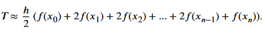

```{r}
# Přesnost: střední
lichobeznikove_pravidlo <- function(f, a, b, n = 100) {
  h <- (b - a) / n
  x <- seq(a, b, by = h); y <- f(x)
  return(h * (sum(y) - (y[1] + y[length(y)])/2))
}
```

#### Simpson's rule (přesnost vysoká)


```{r}
simpsons_rule <- function(f, a, b, n = 100) {
  if (n %% 2 != 0) n <- n + 1  # n musí být sudé
  h <- (b - a) / n
  x <- seq(a, b, by = h); y <- f(x)
  return(h/3 * (y[1] + y[length(y)] + 4 * sum(y[seq(2, n, by = 2)]) + 2 * sum(y[seq(3, n-1, by = 2)])))
}
```

#### Simpson's 3/8 rule (přesnost vysoká)


```{r}
simpsons_3_8_rule <- function(f, a, b, n = 99) {
  if (n %% 3 != 0) n <- n + (3 - n %% 3)  # n musí být dělitelné 3
  h <- (b - a) / n; x <- seq(a, b, by = h); y <- f(x)
  suma <- y[1] + y[length(y)]
  for (i in 2:n) {
    if ((i - 1) %% 3 == 0) suma <- suma + 2 * y[i] else suma <- suma + 3 * y[i]
  }
  return(3*h/8 * suma)
}
```

#### Monte carlo metoda


```{r}
# Přesnost: střední (závisí na počtu bodů)
monte_carlo <- function(f, a, b, n = 10000) return((b - a) * mean(f(runif(n, a, b))))

```

#### Gaussova metoda (výpočet hodnoty integrálu)


```{r}
# 2-bodová Gaussova kvadratura (přesná pro polynomy stupně ≤ 3)
gauss_2body <- function(f, a, b) {
  # Uzly a váhy
  uzly <- c(-1/sqrt(3), 1/sqrt(3)); vahy <- c(1, 1) # Transformace z [-1, 1] na [a, b]
  x <- ((b - a) * uzly + (b + a)) / 2
  return((b - a) / 2 * sum(vahy * f(x)))
}
# 3-bodová Gaussova kvadratura (přesná pro polynomy stupně ≤ 5)
gauss_3body <- function(f, a, b) {
  # Uzly a váhy
  uzly <- c(-sqrt(3/5), 0, sqrt(3/5)); vahy <- c(5/9, 8/9, 5/9)
  x <- ((b - a) * uzly + (b + a)) / 2 # Transformace z [-1, 1] na [a, b]
  return((b - a) / 2 * sum(vahy * f(x)))
}
# 4-bodová Gaussova kvadratura (přesná pro polynomy stupně ≤ 7)
gauss_4body <- function(f, a, b) {
  # Uzly a váhy
  uzly <- c(-0.8611363116, -0.3399810436, 0.3399810436, 0.8611363116)
  vahy <- c(0.3478548451, 0.6521451549, 0.6521451549, 0.3478548451)
  x <- ((b - a) * uzly + (b + a)) / 2 # Transformace z [-1, 1] na [a, b]
  return((b - a) / 2 * sum(vahy * f(x)))
}
gaussova_kvadratura <- function(f, a, b) {
  # Uzly a váhy pro 5-bodovou Gauss-Legendreovu kvadraturu
  uzly <- c(-0.9061798459, -0.5384693101, 0, 0.5384693101, 0.9061798459)
  vahy <- c(0.2369268850, 0.4786286705, 0.5688888889, 0.4786286705, 0.2369268850)
  x <- ((b - a) * uzly + (b + a)) / 2 # Transformace z [-1, 1] na [a, b]
  return((b - a) / 2 * sum(vahy * f(x)))
}
```

#### Rombergova metoda


```{r}
rombergova_metoda <- function(f, a, b, k = 6) {
  R <- matrix(0, nrow = k, ncol = k)
  # První sloupec - lichoběžníkové pravidlo s rostoucím n
  for (i in 1:k) {
    n <- 2^(i-1)
    R[i, 1] <- lichobeznikove_pravidlo(f, a, b, n)
  }
  # Extrapolace
  for (j in 2:k) {
    for (i in j:k) R[i, j] <- (4^(j-1) * R[i, j-1] - R[i-1, j-1]) / (4^(j-1) - 1)
  }
  return(R[k, k])
}
```

#### Horner pro polynomy


```{r}
horner_integrace <- function(koeficienty, a, b) {
  # koeficienty jsou od nejvyššího řádu k nejnižšímu,pro x^2 + 2x + 1: c(1, 2, 1)
  n <- length(koeficienty)
  int_koef <- koeficienty / (n:1) # Koeficienty integrálu (od nejvyššího řádu)
  int_koef <- c(int_koef, 0)  # přidáme konstantu 0 na konec ke koeficientům
  vysledek_b <- int_koef[1] # Hornerovo schéma pro vyhodnocení v bodě b
  for (i in 2:length(int_koef)) vysledek_b <- vysledek_b * b + int_koef[i]
  vysledek_a <- int_koef[1] # Hornerovo schéma pro vyhodnocení v bodě a
  for (i in 2:length(int_koef)) vysledek_a <- vysledek_a * a + int_koef[i]
  return(vysledek_b - vysledek_a)
}
cat("Horner (x^2):            ", horner_integrace(c(1, 0, 0), 0, 1), "\n")
```

```{r, results='hold', echo=TRUE}
cat("Obdélníkové pravidlo:    ", obdelnikove_pravidlo(f, 0, 1, 1000), "\n")
cat("Midpoint rule:           ", midpoint_rule(f, 0, 1, 1000), "\n")
cat("Lichoběžníkové pravidlo: ", lichobeznikove_pravidlo(f, 0, 1, 1000), "\n")
cat("Simpson's rule:          ", simpsons_rule(f, 0, 1, 1000), "\n")
cat("Simpson's 3/8 rule:      ", simpsons_3_8_rule(f, 0, 1, 999), "\n")
cat("Monte Carlo:             ", monte_carlo(f, 0, 1, 10000), "\n")
cat("Gaussova kvadratura:     ", gaussova_kvadratura(f, 0, 1), "\n")
cat("Rombergova metoda:       ", rombergova_metoda(f, 0, 1, 6), "\n")
cat("Horner (x^2):            ", horner_integrace(c(1, 0, 0), 0, 1), "\n")
```

### Typické úlohy

#### Výpočet bodu v dvojnásobném integrálu

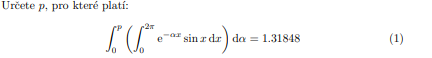

```{r}
# Aproximuje integrál ∫ₐᵇ f(x)dx pomocí obdélníků, Rozdělí interval na n dílů a sečte f(střed) x šířka
MidPointRule <- function(f, a, b, n) {
  h <- (b - a) / n; x <- seq(a + h/2, b - h/2, length.out = n) # Šířka každého dílu, Body uprostřed intervalů
  return(h * sum(f(x))) # Suma obdélníků
}
# Pro danou hodnotu α spočítá integrál přes x
InnerIntegral <- function(alpha) {
  f <- \(x) exp(-alpha * x) * sin(x) # f: exponenciálně tlumený sinus
  return(MidPointRule(f, 0, 2 * pi, 1000)) # Integrujeme od 0 do 2π (jedna perioda sinusoidy), Používáme 1000 bodů pro dobrou přesnost
}
# Pro danou hodnotu p spočítá integrál přes α
OuterIntegral <- function(p) {
  g <- \(alpha) InnerIntegral(alpha) # Pro každé α spočítáme InnerIntegral(α)
  return(MidPointRule(g, 0, p, 1000)) # Integrujeme výsledky od 0 do p
}
FindP <- function(target, p_min, p_max, tol = 1e-7) {
  J_min <- OuterIntegral(p_min); J_max <- OuterIntegral(p_max)
  g_min <- J_min - target; g_max <- J_max - target
  if (J_min > target && J_max > target) print("Target je příliš malý - neexistuje řešení")
  if (J_min < target && J_max < target) print("Target je příliš velký - neexistuje řešení")
  if (g_min * g_max > 0) print("Stejné znaménko - ŽÁDNÉ řešení")
  for (i in 1:1000) {
    pmid <- (p_min + p_max) / 2
    integral_c <- OuterIntegral(pmid)
    if (abs(integral_c - target_value) < tol) return(pmid) 
    integral_a <- OuterIntegral(p_min)
    if ((integral_a - target_value) * (integral_c - target_value) < 0) p_max <- pmid else p_min <- pmid
  }
  result <- (p_min + p_max) / 2 # Výsledek: střed posledního intervalu
  cat(sprintf("\nKonvergence! Interval: [%.7f, %.7f]\n", p_min, p_max))
  cat(sprintf("Výsledek: p = %.7f\n", result))
  return(result)
}
target_value <- 1.31848
p_solution <- FindP(target_value, p_min = -5, p_max = 5, tol = 1e-7)
J_final <- OuterIntegral(p_solution)
error <- abs(J_final - target_value)
cat(sprintf("Nalezené p: %.7f\n", p_solution))
cat(sprintf("J(p): %.7f\n", J_final))
cat(sprintf("Cílová hodnota: %.7f\n", target_value))
cat(sprintf("Absolutní chyba: %.2e\n", error))

p_values <- seq(-2, 5, length.out = 100) # Vytvoříme body pro graf
J_values <- sapply(p_values, OuterIntegral)
plot(p_values, J_values, type = "l", lwd = 2, col = "blue", xlab = "p", ylab = "J(p)", main = "Závislost J(p) na parametru p") # Graf
grid()
points(p_solution, target_value, col = "red", pch = 19, cex = 2) # Označíme cílovou hodnotu
legend("topleft", legend = c(sprintf("Target = %.5f", target_value), sprintf("Řešení: p = %.4f", p_solution)), col = c("blue", "red"), lty = c(1, NA), pch = c(NA, 19), lwd = 2) # Legenda
```

#### Výpočet bodu v integrálu

```{r}
library(ggplot2); library(gridExtra)
# Lagrange - Lagrangeova interpolace
Lagrange <- function(t, x, y){ # počítáme pro bod t, x jsou body dané na ose x, y jsou uzly na ose y (vektor) 
  n <- length(x); suma <- 0
  for (i in 1:n) {
    nasobic <- 1 # jsou použity jako váhy pro příslušné základní polynomy
    for(j in 1:n){
      if(j!=i) nasobic <- nasobic*(t-x[j])/(x[i]-x[j]) # Lagrangeův základní polynom Li(t), která se skládá z násobků (t-xj)/(xi-xj), kde j se nerovná i.
    }
    suma <- suma + y[i] * nasobic # suma hodnot všech základních polynomů násobených odpovídající hodnotou y[i]
  }
  return(suma) # hodnota interpolovaného polynomu v bodech t stupně n-1
}
# LSA - Metoda nejmenších čtverců pro polynomiální aproximaci
LSA <- function(x, y, n){ # x a y je vektor hodnot, n je stupeň polynomu
  A <- matrix(0, n, n); b <- numeric(n) # vytvoření matice A a vektoru b
  for(i in 1:n){
    for(j in 1:n) A[i,j] <- sum(x^(i+j-2)) # A je matice součtů mocnin x
    b[i] <- sum(y*x^(i-1)) # b je vektor součtů součinů yx^i-1
  } # vyřeší se lin. soustava rovnic LS: A*c=b což
  return(solve(A, b)) # vrátí vektor koeficientů c (aprox. polynomu)
}
# Vyhodnocení polynomu pomocí Hornerova schématu, P(x)=(…((anx+an-1)x+an-2)*x+…+a1)x+a0
Horner <- function(x, coef){ 
  n <- length(coef); res <- coef[n] # Výpočet začíná od nejvyššího koef.
  for (i in (n-1):1) res <- res*x+coef[i] # pro každý koef. od an-1 po a0 akt. res=res*x+ai se postupně přidává k dalším koeficientům
  return(res) # hodnota polynomů pro dané x
}
#definování funkce integrálu
f <- \(x) return(1/(sqrt(2+pi)) * exp(-x*x/2)) 
#simpsnovo pravidlo pro výpočet integrálu
simpson_integration <- function(f, a, b, n = 1000) {
  if (n %% 2 == 1) n <- n + 1  # n musí být sudé
  h <- (b - a) / n; x <- seq(a, b, length.out = n + 1); y <- sapply(x, f)
  return(h/3 * (y[1] + 4*sum(y[seq(2, n, by = 2)]) + 2*sum(y[seq(3, n-1, by = 2)]) + y[n+1]))
}
#hledání hodnoty b pomocí bisekce
find_b_for_integral <- function(f, target_value = 0.05) {
  a <- 0; b <- 2; tolerance <- 1e-8; max_iter <- 100
  for (i in 1:max_iter) {
    c <- (a + b) / 2
    integral_c <- simpson_integration(f, 0, c)
    if (abs(integral_c - target_value) < tolerance) return(c) 
    integral_a <- simpson_integration(f, 0, a)
    if ((integral_a - target_value) * (integral_c - target_value) < 0) b <- c else a <- c
  }
  return(c)
}
b_value <- find_b_for_integral(f, 0.05)
cat("Hodnota b pro integrál = 0.05:", round(b_value, 6), "\n")
verification <- simpson_integration(f, 0, b_value)
cat("Ověření výsledku - integrál od 0 do b:", round(verification, 6), "\n")
# 2. Výpočet hodnot pro interpolaci a aproximaci
x_points <- seq(0.05, 0.25, by = 0.05)  # 0.05, 0.10, 0.15, 0.20, 0.25
y_points <- sapply(x_points, f)
x_fine <- seq(0.05, 0.25, by = 0.001)
lagrange_values <- sapply(x_fine, \(x) Lagrange(x, x_points, y_points))
cat("Ověření interpolace v původních bodech:\n")
for(i in 1:length(x_points)) cat(sprintf("x=%.2f: očekáváno=%.6f, vypočteno=%.6f,\n", x_points[i], y_points[i], Lagrange(x_points[i], x_points, y_points)))
x_fine <- seq(0.05, 0.25, by = 0.001) 
degree_4 <- LSA(x_points, y_points, 5)  # polynom 4. stupně (5 koeficienty)
cat("Stupeň 4:", paste(round(degree_4, 6), collapse = ", "), "\n")
poly_4_values <- sapply(x_fine, \(x) Horner(x, degree_4))
plot(x_fine, sapply(x_fine, f), type = "l", lwd = 2, col = "green", xlab = "b", ylab = "f(b)", main = "Funkce")
plot(x_fine, lagrange_values, type = "l", lwd = 2, col = "blue", xlab = "b", ylab = "f(b)", main = "Lagrange")
points(x_points, y_points, col = "red", pch = 20, cex = 2)
plot(x_fine, poly_4_values, type = "l", lwd = 2, col = "green", xlab = "b", ylab = "f(b)", main = "LSA")
```

#### Hledání extrémů ve funkci (průběh funkce)

```{r}
f <- function(x) return(cos(5*acos(x))) #nadefinujeme si funkci
fd <- function(f,x, h=1e-5) return((f(x+h)-f(x-h))/(2*h)) #první derivace (centrální difference), k aproximaci první derivace (přesnější než dopředná)
fdd <- function(f,x, h=1e-5) return((f(x+h)-2*f(x)-f(x-h))/(2*h)) #druhá derivace (pomocí centrální difference)
#najdem extremy, kde f'(x)=0 v celé funkci od -1 do 1
x_hodnoty <- seq(-1,1,length.out=100000) # rozsah x a i vytvoření osy k interpolaci, lenght.out je citlivost zaznamenávání extrémů (zde musí být vykoká)
derivace <- sapply(x_hodnoty, \(x) fd(f,x))
extremy <- x_hodnoty[which(abs(derivace)<1e-3)] #vyfiltrujeme hodnoty přibližné 0 aby zbyly extrémy
extremy <- x_hodnoty[which(diff(sign(derivace)) != 0)] #vymažu stejné hodnoty
#rozlišíme minima a maxima podle druhé derivace, podle toho jestli je <>
druhe_derivace <- sapply(extremy, \(x) fdd(f,x,h=1e-1))
typy_extremu <- ifelse(druhe_derivace>0,"Minimum","Maximum")
print(extremy) #můžem si je vypsat pro kontrolu
#najdeme kořeny pro řešení f(x)=0
bisekce <- function(f, a, b){
  fa <- f(a); fb <- f(b) 
  if(fa*fb < 0){ 
    repeat{
      c <- (a+b)/2 
      if(c == a || c == b) return(c) 
      fc <- f(c)
      if(fa*fc < 0) b <- c else a <- c
    }
  } 
  else{ stop("Spatne vstupni zadani"); return(FALSE) }
}
#hledání kořenů mezi intervaly v celý funkci od -1 do 1
koreny <- c()
for(i in 1:(length(x_hodnoty)-1)){ #projdém iteraci délkou x hodnot
  if(f(x_hodnoty[i])*f(x_hodnoty[i+1])<0){ #zjišťuji jestli existuje v intervalu kořen
    koren <- bisekce(f,x_hodnoty[i],x_hodnoty[i+1])
    if (!is.na(koren)) koreny <- c(koreny, koren) #přidání nalezen. kořene do vektoru pokud není NA
  }
}
print(koreny) #můžem si vypsat pro kontrolu
#vykreslení extrémů a kořenů
plot(x_hodnoty, f(x_hodnoty),type="l",col="green",lwd=2, main="Numerické hledání extrémů a kořenů", xlab="x", ylab="f(x)") #interpolace funkce
points(extremy,f(extremy),col=ifelse(typy_extremu == "Minimum", "blue", "red"), pch=19)
points(koreny, f(koreny), col="purple", pch=4)
```

#### Laplaceova rovnice

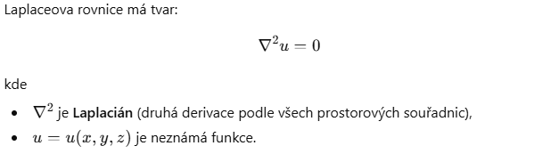

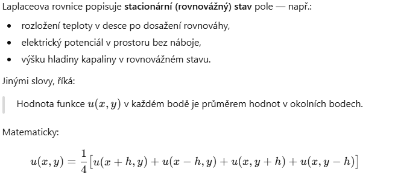

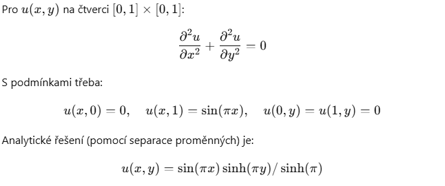

```{r}
# Laplaceova rovnice je parciální DR 2. řádu:
# ∂²u/∂x² + ∂²u/∂y² = 0, kde u(x,y) je neznámá funkce dvou proměnných.
# FYZIKÁLNÍ INTERPRETACE:
# - Stacionární rozložení teploty (rovnováha)
# - Elektrický potenciál v prostoru bez nábojů
# - Ustálené proudění tekutin
# Prostor rozdělíme na mřížku bodů s krokem h:
#   ∂²u/∂x² ≈ (u(i-1,j) - 2u(i,j) + u(i+1,j)) / h²
#   ∂²u/∂y² ≈ (u(i,j-1) - 2u(i,j) + u(i,j+1)) / h²
# Dosazením do Laplaceovy rovnice:
#   (u(i-1,j) - 2u(i,j) + u(i+1,j))/h² + (u(i,j-1) - 2u(i,j) + u(i,j+1))/h² = 0
# Po úpravě (h² se zkrátí):
#   u(i-1,j) + u(i+1,j) + u(i,j-1) + u(i,j+1) - 4u(i,j) = 0
# Řešení pro u(i,j):
#   u(i,j) = (u(i-1,j) + u(i+1,j) + u(i,j-1) + u(i,j+1)) / 4, Hodnota v každém bodě je PRŮMĚR jeho 4 sousedů!
library(ggplot2); library(scales)
# Princip: V každé iteraci vypočteme nové hodnoty ze STARÝCH hodnot sousedů
# u_new(i,j) = 1/4 * [u_old(i-1,j) + u_old(i+1,j) + u_old(i,j-1) + u_old(i,j+1)]
# Vyžaduje dvě matice (stará a nová), pomalá konvergence.
jacobi_method <- function(n = 50, boundary_top = 100, max_iter = 10000, tol = 1e-6){ # u(i,j) = 1/4 · [u(i-1,j) + u(i+1,j) + u(i,j-1) + u(i,j+1)]
  U_old <- matrix(0, n, n); U_new <- matrix(0, n, n)
  U_old[1, ] <- boundary_top  # Horní okraj
  U_new[1, ] <- boundary_top
  for (iter in 1:max_iter) {
    max_change <- 0
    for (i in 2:(n-1)) {
      for (j in 2:(n-1)) {
        U_new[i, j] <- 0.25 * (U_old[i-1, j] + U_old[i+1, j] + U_old[i, j-1] + U_old[i, j+1])
        max_change <- max(max_change, abs(U_new[i, j] - U_old[i, j]))
      }
    }
    if (max_change < tol) { cat(sprintf("\n\nKonvergence po %d iteracích! (změna < %.0e)\n", iter, tol)); break }
    # Příprava na další iteraci
    U_old <- U_new
  }
  if (iter == max_iter) { cat(sprintf("\nDosažen maximální počet iterací\n")) }
  #cat(sprintf("\nHodnota ve středu [%d,%d]: %.6f\n\n", n/2, n/2, U_new[n/2, n/2]))
  return(U_new)
}
# Princip: Okamžitě používáme NOVÉ hodnoty, jakmile jsou dostupné
# u(i,j) = 1/4 * [u_NEW(i-1,j) + u_old(i+1,j) + u_NEW(i,j-1) + u_old(i,j+1)]
#                 ^^^^^^^^                      ^^^^^^^^
#                 již vypočtené               ještě nevypočtené
# Potřebuje jen jednu matici, 2× rychlejší konvergence než Jacobi!
gauss_seidel_method <- function(n = 50, boundary_top = 100, max_iter = 10000, tol = 1e-6) {
  # Vzorec: stejný jako Jacobi, ale: Okamžitě používáme nově vypočtené hodnoty
  # Rychlejší konvergence (~2× rychlejší než Jacobi)\n\n")
  U <- matrix(0, n, n) # Inicializace (jen jedna matice!)
  U[1, ] <- boundary_top
  for (iter in 1:max_iter) {
    max_change <- 0
    for (i in 2:(n-1)) {
      for (j in 2:(n-1)) {
        old_value <- U[i, j]
        U[i, j] <- 0.25 * (U[i-1, j] + U[i+1, j] + U[i, j-1] + U[i, j+1])
        max_change <- max(max_change, abs(U[i, j] - old_value))
      }
    }
    if (max_change < tol) { cat(sprintf("Konvergence po %d iteracích!\n", iter)); break }
  }
  #cat(sprintf("\nHodnota ve středu [%d,%d]: %.6f\n\n", n/2, n/2, U[n/2, n/2]))
  return(U)
}
# Princip: Převedeme PDE na soustavu Ax = b a vyřešíme přímo
# Pro každý vnitřní bod (i,j): u(i-1,j) + u(i+1,j) + u(i,j-1) + u(i,j+1) - 4·u(i,j) = 0
# Matice A má na diagonále 4, sousední body -1
direct_solve_method <- function(n = 50, boundary_top = 100) {
  # Převedeme PDE na soustavu lineárních rovnic:
  # 4·u(i,j) - u(i-1,j) - u(i+1,j) - u(i,j-1) - u(i,j+1) = b
  # Počet vnitřních bodů
  n_inner <- (n - 2) * (n - 2)
  # Vytvoření matice A a vektoru b
  A <- matrix(0, n_inner, n_inner); b <- numeric(n_inner)
  for (i in 2:(n-1)) {
    for (j in 2:(n-1)) {
      k <- (i - 2) * (n - 2) + (j - 1)
      # Diagonální prvek
      A[k, k] <- 4
      # Sousední body
      if (i > 2) A[k, k - (n-2)] <- -1      # Bod nahoře
      if (i < n-1) A[k, k + (n-2)] <- -1    # Bod dole
      if (j > 2) A[k, k - 1] <- -1          # Bod vlevo
      if (j < n-1) A[k, k + 1] <- -1        # Bod vpravo
      # Pravá strana (okrajové podmínky)
      if (i == 2) b[k] <- boundary_top      # Horní okraj
    }
  }
  # Řešení soustavy
  x <- solve(A, b)
  # Převod zpět na matici
  U <- matrix(0, n, n)
  U[1, ] <- boundary_top
  for (i in 2:(n-1)) {
    for (j in 2:(n-1)) {
      k <- (i - 2) * (n - 2) + (j - 1)
      U[i, j] <- x[k]
    }
  }
  cat(sprintf("Hodnota ve středu [%d,%d]: %.6f\n\n", n/2, n/2, U[n/2, n/2]))
  return(U)
}
# Vytvoření grafů
par(mfrow = c(2, 2), mar = c(4, 4, 3, 2))
# Funkce pro plot
plot_heatmap <- function(U, title) {
  image(1:nrow(U), 1:ncol(U), U, col = heat.colors(100), xlab = "x", ylab = "y", main = title)
  contour(1:nrow(U), 1:ncol(U), U, add = TRUE, nlevels = 10)
}
n <- 50; boundary <- 100
plot_heatmap(jacobi_method(n, boundary, max_iter = 10000), "Jacobi Iterace")
plot_heatmap(gauss_seidel_method(n, boundary, max_iter = 10000), "Gauss-Seidel")
plot_heatmap(direct_solve_method(n, boundary), "Přímé řešení")
```

```{r}
#iterační řešení laplaceovy rovnice (je parciální dif. rovnice, která popisuje stacionární(časově neměnné fyz. procesy, jako jsou tepelná vodivost,...)), vypadá takto: (d^2u/dx^2)+(d^2u/dy^2)=0
A <- matrix(0, 50, 50) #Matice A o rozměrech 50*50 reprezentuje mřížku 2D prostoru
A[1, ] <- 100 #Horní okraj mřížky je nastaven na hodnotu 100, ostatní body na 0
for(k in 1:10000){
  for(i in 2:49){
    for(j in 2:49) A[i,j] <- 0.25*(A[i-1,j] + A[i+1, j] + A[i, j-1] + A[i, j+1]) #Iterativcně se aktualizují hodnoty uvnitř mřížky pomocí váženého průměru hodnot okolních bodů uij= 1/(ui-1,+ui+1,j atd…)
  }
}
print(A[25,25]) #střed mřížky
#Vykreslení vizualizace heatmapy výsledné matice
library(ggplot2); library(scales)
ggplot(as.data.frame(as.table(A)), aes(Var1, Var2, fill = Freq)) +
  geom_tile() + scale_fill_gradient(low = "blue", high = "red") +
  labs(title = "Heatmap of Matrix Values", x = "Row", y = "Column", fill = "Value") + theme_minimal() + coord_fixed(ratio = 1)

n <- 48*48; A <- matrix(0, n, n); b <- numeric(n) #Matice A a vektor b odpovídají Laplaceově rovnici na mřížce 48*48 (bez okrajových bodů), Ax=b
for(i in 2:49){ #Každý bod mřížky je reprezentován jednou rovnicíí, kde diagonální prvek odpovídá hodnotě bodu a okolní prvky jeho sousedům.
  for(j in 2:49){
    k <- (i-2)*48+j-1
    A[k,k] <- 4
    if(i > 2) A[k, k-48] <- -1
    if(i == 2) b[k] <- 100
    if(i < 49) A[k, k+48] <- -1
    if(j > 2) A[k, k-1] <- -1
    if(j < 49) A[k, k+1] <- -1
  }
}
#hodnota v bodě 25,25, která je získána vyřešením soustavy rovnic pomocí funkce solve
x <- solve(A, b) 
i <- 25; j <- 25
print(x[(i-2)*48+j-1])
#modeluje nám fyzikální jevy
```

#### Dosazování do matice s řešení sousavy rovnic

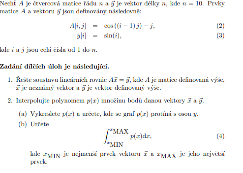

```{r}
n <- 10; A <- matrix(0, n, n); y <- numeric(n)
for (i in 1:n) {
  for (j in 1:n) A[i, j] <- cos((i-1) * j) - j
  y[i] <- sin(i)
}
# 1. Řešení soustavy A * x = y
Gauss <- function(A,b){ #řešení lineárních rovnic Ax = b
  n <- length(b); Ab <- cbind(A,b) #uprava původní matice A do horní trojúhelnikové formy pomocí přímého chodu, řešení rovnice zpětným chodem pro přímý chod
  #přímý chod (pro každý sloupec(k) zrušíme prvky pod diagonálou násobem a odečítáním řádků, výsledkem je (horní trojúhelníková matice pro zpětný chod)
  for (k in 1:(n-1)) {
    max_row <- which.max(abs(Ab[(k:n),k]))+k-1 #(maximální prvek v akt sloupci pod nebo na diagonale)
    if(max_row != k){
      j <- k:(n+1)
      temp <- Ab[k,j]
      Ab[k,j] <- Ab[max_row,j]
      Ab[max_row,j] <- temp
    }
    for(i in (k+1):n){
      c <- -Ab[i,k]/Ab[k,k]
      j <- (k+1):(n+1)
      Ab[i,j] <- Ab[i,j] + c*Ab[k,j]
    }
  }
  #zpětný chod (počítáme neznámé, začínáme od posledního řádku a postupujeme nahoru, postupně počítáme neznámé x pomocí horní trojúhelníkové matice)
  x <- b
  x[n] <- Ab[n,n+1]/Ab[n,n]
  for (i in (n-1):1) x[i] <- (Ab[i,n+1] - sum(Ab[i,(i+1):n]*x[(i+1):n]))/Ab[i,i]
  return(x) #vektor x, který je řešení soustavy lin. rovnic
}
print(solve(A, y)); print(Gauss(A,y))
x = Gauss(A,y)
# 2. Interpolace polynomem p(x)
polyfit <- function(x, y, deg) return(coef(lm(y ~ poly(x, deg, raw = TRUE))))
NewtonPolCoef <- function(x,y){ #vektor bodů na ose x a y(mnoziny bodů)
  n <- length(x); coef <- numeric(n) #vytvoření prázdného vektoru
  coef[1] <- y[1] #první coef c1 a y1
  if(n > 1){ 
    for (i in 2:n) {
      suma <- coef[1]; nasobic <- 1
      for(j in 1:(i-1)){
        nasobic <- nasobic*(x[i]-x[j])
        suma <- suma + coef[j]*nasobic
      } #metoda dělených rozdílů, koeficienty c[i] jsou počítány iterativně pomocí dělených rozdílů a předchozích výsledků.
      coef[i] <- (y[i]-suma)/nasobic
    } #c jsou koef. získané pomocí dělených rozdílů
  }
  return(coef) #Vektor koeficientů Newtnova polynomu
}
#pol. P(t)=c1+c2(t-x1)+c3(t-x1)(t-x2)+...+cn-1(t-x1)(t-x2)...(t-xn-1)
NewtonPolValue <- function(t,x,coef){#t-bod,kde hodnotíme polynom.x: uzly na ose x, coef: koeficienty pol. vypoc. funkcí NewtonPolCoef.
  n <- length(coef); res <- coef[n] # Začíná od posledního koeficientu cn
  for (i in (n-1):1) res <- res*(t-x[i])+coef[i] # Newtonův polynom je vyjádřen v rekurzivním tvaru s využitím základních polynomů P(t)
  return(res) #hodnota polynomu v bodech t P(t)
}
LSA <- function(x, y, n){ #x a y jevektor hodnot, n je stupeň polynomu
  A <- matrix(0, n, n); b <- numeric(n) #vytvoření matice A a vektoru b
  for(i in 1:n){
    for(j in 1:n) A[i,j] <- sum(x^{i+j-2}) # b je vektor součtů součinů yx^i-1
    b[i] <- sum(y*x^{i-1}) # součty součinů y*x^(i-1)
  } #vyřeší se lin. soustava rovnic LS: A*c=b což
  return(solve(A, b)) # vrátí vektor koeficientů c (aprox. polynomu)
}
#pol.: P(x)=(…((anx+an-1)x+an-2)*x+…+a1)x+a0, kde tento přístup minimalizuje počet násobení a sčítání (operací) při výpočtu hodnoty polynomu
Horner <- function(x,coef){ 
  n <- length(coef); res <- coef[n] #Výpočet začíná od nejvyššího koef.
  for (i in (n-1):1) res <- res*x+coef[i] #se postupně přidává k dalším koeficientům tak, že každý mezivýsledek res násobíme x a přičítáme další koef.
  return(res) #hodnota polynomů pro dané x
}# vhodné pouze pro hodnocení polynomu
t <- seq(0,2*pi,by=0.01)
plot(x,y)
lines(t,NewtonPolValue(t,x,NewtonPolCoef(x,y)),col="orange") #newtonova interpolace
# 3. Najdeme průsečík s osou y
coef <- LSA(x,y,5)
plot(\(x) Horner(x, coef), add=TRUE, col='red', lw = 2, xlim = c(-3, 3))
polyval <- function(coef, x) return(sapply(x, function(xi) sum(coef * xi^(length(coef)-1:0))))
abline(h=0, col='blue') 
# 4. Výpočet integrálu polynomu
x_min <- min(x); x_max <- max(x)
MidPointRule <- function(f, a, b, n) {
  h <- (b - a) / n; x <- seq(a + h/2, b - h/2, length.out = n)
  return(h * sum(f(x)))
}
integral_value <- MidPointRule(\(x) Horner(x,coef) , x_min, x_max, 1000)
cat("Hodnota integrálu:", integral_value, "\n")
```

#### Dosazování do rovnice s určitým integrálem

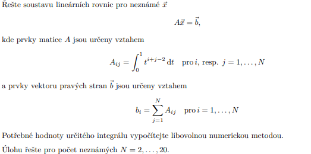

```{r}
#výpočet integrálu
simpsons_rule <- function(f, a, b, n = 1000) {
  h <- (b - a) / n; x <- seq(a, b, length.out = n + 1); y <- f(x)
  return((h / 3) * (y[1] + 4 * sum(y[seq(2, n, by = 2)]) + 2 * sum(y[seq(3, n-1, by = 2)]) + y[n + 1]))
}
# výpočet matice A
construct_A <- function(N) {
  A <- matrix(0, nrow=N, ncol=N)
  for (i in 1:N) {
    for (j in 1:N) A[i, j] <- simpsons_rule(\(t) t^(i + j - 2), 0, 1)
  }
  return(A)
}
# výpočet vektoru b
construct_b <- function(A) return(rowSums(A))  # Sum across rows

gaussova_metoda <- function(A, b) {
  n <- nrow(A); Ab <- cbind(A, b)  
  for (k in 1:(n-1)) {
    max_idx <- which.max(abs(Ab[k:n, k])) + k - 1
    if (max_idx != k) { 
      temp <- Ab[k, ]
      Ab[k, ] <- Ab[max_idx, ]
      Ab[max_idx, ] <- temp
    }
    for (i in (k+1):n) { 
      faktor <- Ab[i, k] / Ab[k, k]
      Ab[i, ] <- Ab[i, ] - faktor * Ab[k, ]
    }
  }
  x <- numeric(n)
  x[n] <- Ab[n, n+1] / Ab[n, n]
  for (i in (n-1):1) x[i] <- (Ab[i, n+1] - sum(Ab[i, (i+1):n] * x[(i+1):n])) / Ab[i, i]
  return(x)
}
for (N in 2:20) {
  A <- construct_A(N); b <- construct_b(A)
  x <- gaussova_metoda(A, b)#;print(x)
  svd_A = svd(A)
  x <- svd_A$v %*% diag(1 / svd_A$d) %*% t(svd_A$u) %*% b
}
print(x[1:10]) #prvních 10 řešení pro n=1...10
```

#### Num. integrace pomocí newton-cotesových vzorců

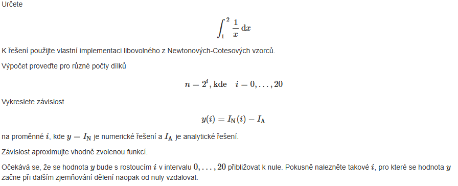

```{r}
# 1. Definice funkce a analytické řešení
f <- \(x) { 1/x } # integrujeme f(x) = x
a <- 1; b <- 2; IA <- (b^2 - a^2) / 2 # analytické řešení integrálu
cat("Analytické řešení =", IA, "\n")
TrapezoidalRule <- function(f, a, b, n) {
  h <- (b - a) / n; s <- 0.5 * f(a) + 0.5 * f(b)
  for (k in 1:(n-1)) s <- s + f(a + k * h)
  return(h * s)
}
# Smyčka pro n = 2^i, i=0..20
I_num <- numeric(21)   # sem uložíme numerické výsledky
y <- numeric(21)       # sem uložíme chyby
for (i in 0:20) {
  n <- 2^i
  I_num[i+1] <- TrapezoidalRule(f, a, b, n)
  y[i+1] <- I_num[i+1] - IA
}
# Vykreslení výsledků, chyba y(i) v závislosti na i
plot(0:20, y, type="b", col="blue", pch=19, xlab="i (n = 2^i)", ylab="y(i) = I_N - I_A", main="Chyba lichoběžníkové metody")
abline(h=0, col="red", lty=2)
plot(0:20, log10(abs(y)), type="b", col="darkgreen", pch=19, xlab="i (n = 2^i)", ylab="log10(|chyba|)", main="Pokles chyby vs. i (očekáváme sklon -2)")
```

#### Řešení soustavy rovnic pomocí interpolace polynomem

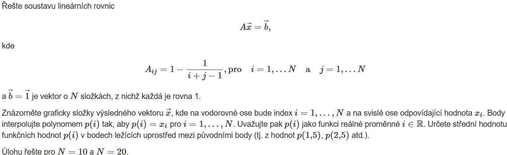

```{r}
makeA <- function(N) {
  A <- matrix(0, nrow=N, ncol=N)
  for(i in 1:N) {
    for(j in 1:N) A[i,j] <- 1 - 1/(i+j-1)
  }
  return(A)
}
# Newtonova interpolace
newton_coef <- function(x, y) {
  n <- length(x); coef <- y
  for (j in 2:n) {
    for (i in n:j) coef[i] <- (coef[i] - coef[i-1]) / (x[i] - x[i-j+1])
  }
  return(coef)
}
newton_eval <- function(coef, x_nodes, x) {
  n <- length(coef)
  result <- coef[n]
  for (i in (n-1):1) result <- result * (x - x_nodes[i]) + coef[i]
  return(result)
}
Gauss <- function(A,b){ #řešení lineárních rovnic Ax = b
  n <- length(b); Ab <- cbind(A,b) #uprava původní matice A do horní trojúhelnikové formy pomocí přímého chodu, řešení rovnice zpětným chodem pro přímý chod
  #přímý chod (pro každý sloupec(k) zrušíme prvky pod diagonálou násobem a odečítáním řádků, výsledkem je (horní trojúhelníková matice pro zpětný chod)
  for (k in 1:(n-1)) {
    #pivot - můžem dát pro vylepšení
    max_row <- which.max(abs(Ab[(k:n),k]))+k-1 #(maximální prvek v akt sloupci pod nebo na diagonale)
    if(max_row != k){
      j <- k:(n+1)
      temp <- Ab[k,j]
      Ab[k,j] <- Ab[max_row,j]
      Ab[max_row,j] <- temp
    }
    for(i in (k+1):n){
      c <- -Ab[i,k]/Ab[k,k]
      j <- (k+1):(n+1)
      Ab[i,j] <- Ab[i,j] + c*Ab[k,j]
    }
  }
  #zpětný chod (počítáme neznámé, začínáme od posledního řádku a postupujeme nahoru, postupně počítáme neznámé x pomocí horní trojúhelníkové matice)
  x <- b
  x[n] <- Ab[n,n+1]/Ab[n,n]
  for (i in (n-1):1) {
    x[i] <- (Ab[i,n+1] - sum(Ab[i,(i+1):n]*x[(i+1):n]))/Ab[i,i]
  }
  return(x) #vektor x, který je řešení soustavy lin. rovnic
}
# Hlavní výpočet
solve_system <- function(N) {
  A <- makeA(N); b <- rep(1, N)
  x <- Gauss(A, b); print(x)
  plot(1:N, x, type="b", col="blue", main=paste("Reseni pro N =", N), xlab="i", ylab="x[i]")
  coef <- newton_coef(1:N, x)
  mids <- seq(1.5, N-0.5, by=1) # hodnoty uprostřed
  mid_vals <- sapply(mids, \(xx) newton_eval(coef, 1:N, xx))
  points(mids, mid_vals, col="red", pch=19)  # přidáme červené body
  return(list(x=x, mids=mids, mid_vals=mid_vals))
}
x10 <- solve_system(10)
x20 <- solve_system(20)
```

#### Interpolace polynomu pomocí rovnice závislosti


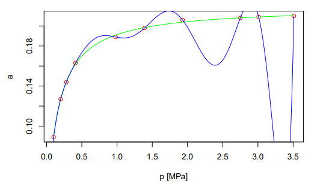

```{r}
p <- c(0.1, 0.2, 0.28, 0.41, 0.98, 1.39, 1.93, 2.75, 3.01, 3.51)
a <- c(0.089, 0.127, 0.144, 0.163, 0.189, 0.198, 0.206, 0.208, 0.209, 0.210)
knitr::kable(t(setNames(data.frame(p, a), c("$p$ [MPa]", "$a$"))))
plot(p, a, col='red', xlab="p [MPa]", pch=19, cex=1)
Vandermonde <- function(x,y){
  n <- length(x); A <- matrix(1,nrow = n, ncol = n)
  for(j in 2:n) A[,j] <- A[,j-1]*x #pro kaž. bod(xi,yi) platí že hodnota P(xi) se musí=yi, a*c=y, c - vektor koeficientú, y - vektor hodnot
  return(solve(A,y)) #vektor c koeficientů interp. polynomu stupně n-1
}
#pol. je obecně vyjádř. ve tvaru: P(x)=anx^n+an-1x^n-1+…+a1x+a0
Horner <- function(x,coef){ #vyhodnocení polynomu pomocí tvaru funkce: P(x)=(…((anx+an-1)x+an-2)*x+…+a1)x+a0, kde tento přístup minimalizuje počet násobení a sčítání (operací) při výpočtu hodnoty polynomu
  n <- length(coef); res <- coef[n] #Výpočet začíná od nejvyššího koef.
  for (i in (n-1):1) res <- res*x+coef[i] #pro každý koef. od an-1 po a0 akt. res=res*x+ai, se postupně přidává k dalším koeficientům tak, že každý mezivýsledek res násobíme x a přičítáme další koef.
  return(res) #hodnota polynomů pro dané x
}# vhodné pouze pro hodnocení polynomu
NewtonPolCoef <- function(x,y){ #vektor bodů na ose x a y(mnoziny bodů)
  n <- length(x); coef <- numeric(n) #vytvoření prázdného vektoru
  coef[1] <- y[1] #první coef c1 a y1
  if(n > 1){ 
    for (i in 2:n) {
      suma <- coef[1]; nasobic <- 1
      for(j in 1:(i-1)){
        nasobic <- nasobic*(x[i]-x[j])
        suma <- suma + coef[j]*nasobic
      } # metoda dělených rozdílů, koeficienty c[i] jsou počítány iterativně pomocí dělených rozdílů a předchozích výsledků.
      coef[i] <- (y[i]-suma)/nasobic
    } #c jsou koef. získané pomocí dělených rozdílů
  }
  return(coef) #Vektor koeficientů Newtnova polynomu
}
#pol. P(t)=c1+c2(t-x1)+c3(t-x1)(t-x2)+...+cn-1(t-x1)(t-x2)...(t-xn-1)
NewtonPolValue <- function(t,x,coef){ #t-bod,kde hodnotíme polynom.x: uzly na ose x, coef: koeficienty pol. vypoc. funkcí NewtonPolCoef.
  n <- length(coef); res <- coef[n] #Začíná od posledního koeficientu cn
  for (i in (n-1):1) res <- res*(t-x[i])+coef[i] # Newtonův polynom je vyjádřen v rekurzivním tvaru s využitím základních polynomů P(t)
  return(res) #hodnota polynomu v bodech t P(t)
}
Lagrange <- function(t,x,y){ #počítáme bod t, kde chceme spočítat intepolaci, x jsou body dané na ose x, y jsou uzly na ose y (vektor) 
  n <- length(x); suma <- 0
  for (i in 1:n) {
    nasobic <- 1#jsou použity jako váhy pro příslušné základní polynomy
    for(j in 1:n){
      if(j!=i) nasobic <- nasobic*(t-x[j])/(x[i]-x[j]) #Lagrangeův základní polynom Li(t), která se skládá z násobků (t-xj)/(xi-xj), kde j se nerovná i. 
    }
    suma <- suma+y[i]*nasobic #suma hodnot všech základních polynomů násobených odpovídající hodnotou y[i]
  }
  return(suma) #hodnota interpolovaneho polynomu v bodech t stupně n-1
}
t <- seq(min(p),max(p),by=0.001) #celá čára (místo by můžem použít leght.out)
lines(t,Horner(t, Vandermonde(p,a)),col="green", lwd=1) 
lines(t,NewtonPolValue(t,p,NewtonPolCoef(p,a)),col="orange")
model <- nls(a ~ (am * b * p) / (1 + b * p), start = list(am = 0.22, b = 1))
params <- coef(model)
am_est <- params["am"]
b_est <- params["b"]
# Interpolating Polynomial (Using Polynomial Regression), Generate a sequence for smooth plotting
p_seq <- seq(min(p), max(p), length.out = 100)
a_model <- (am_est * b_est * p_seq) / (1 + b_est * p_seq) #analytické vyjádření závislosti a(p)
#plot(p, a, col="red", pch=16, xlab="p [MPa]", ylab="a", main="Data, Model Fit, and Interpolation")
lines(p_seq, a_model, col="blue", lwd=1)  # Model Fit
legend("bottomright", legend=c("Data", "Model Fit", "Polynomial Interpolation"),  col=c("red", "blue", "green"), pch=c(16, NA, NA), lty=c(NA, 2, 3), lwd=c(NA, 2, 2))
print(paste("Estimated am:", round(am_est, 4))); print(paste("Estimated b:", round(b_est, 4)))
```

#### Řešení integrace pomocí diferenciální rovnice 1. řádu

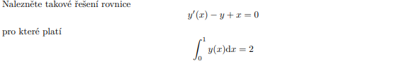

```{r}
f <- \(x, y) { return(y - x) } # y' = y - x
RK4 <- function(x,y,f,h){ #4 mezikroky k dosažení vyšší přesnosti, má velmi malou chybu i při větších krocích. Bere totiž v úvahu. derivace na začátku, uprostřed a na konci intervalu.
  hhalf <- 0.5*h
  k1 <- f(x,y); k2 <- f(x+hhalf,y+hhalf*k1); k3 <- f(x+hhalf,y+hhalf*k2); k4 <- f(x+h,y+h*k3)
  return (y+((h/6)*(k1+2*(k2+k3)+k4)))
} 
RK4_solve <- function(x0, y0, f, h, x_end) {
  x_vals <- seq(x0, x_end, by = h); y_vals <- numeric(length(x_vals))
  y_vals[1] <- y0
  for (i in 2:length(x_vals)) y_vals[i] <- RK4(x_vals[i-1], y_vals[i-1], f, h)
  return(list(x = x_vals, y = y_vals))
}
bisekce <- function(target_integral, tol = 1e-4) {
  a <- 0; b <- 1; max_iter <- 100
  for (iter in 1:max_iter) {
    c <- (a + b) / 2  
    sol <- RK4_solve(0, c, f, h = 0.001, x_end = 1)  # Řešíme ODE pomocí RK4
    integral_approx <- sum(sol$y) * 0.01  # Přibližný integrál
    if (abs(integral_approx - target_integral) < tol) {
      return(list(y0 = c, solution = sol))  # Našli jsme správné y(0)
    }
    if (integral_approx > target_integral) { b <- c } 
    else { a <- c }
  }
  return(NULL)
}
# Najdeme správnou počáteční podmínku
n <- 10; x <- 0; y <- 1; h=0.01
for (i in 1:n) {
  y <- RK4(x, y, f, h)
  x <- x + h
  cat("x =", x, ", y =", y, "\n")
}
result <- bisekce(2)
print(result$y0)  # Hodnota y(0)
plot(result$solution$x, result$solution$y, type="l", col="blue", lwd=2, main="Řešení ODE metodou bisekce", xlab="x", ylab="y(x)")
```

#### Van der Vaals stavová rovnice

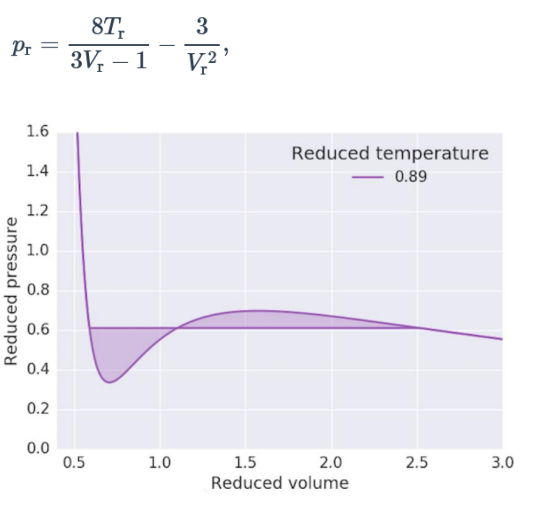

```{r}
vdw_pressure <- \(Vr, Tr) ((8 * Tr) / (3 * Vr - 1)) - (3 / Vr^2)
Vr_range <- seq(0.5, 3.0, by = 0.0001) # Definujeme rozsah redukovaných objemů
Tr <- 0.89 # Redukovaná teplota (z grafu vidíme Tr = 0.89)
pr_values <- vdw_pressure(Vr_range, Tr) # Vypočítáme redukované tlaky
df <- data.frame(Vr = Vr_range, pr = pr_values)
plot(df, type="l", col="purple", lwd=2, xlab="Reduced volume", ylab="Reduced pressure", ylim=c(0,1.6))
y_line <- 0.6
x_vals <- seq(0.6, 2.6, by=0.01)
y_vals <- rep(y_line, length(x_vals))
lines(x_vals, y_vals, col="purple", lwd=2)
min_index <- which.min(pr_values) # Najdeme minimum (pokud existuje)
min_Vr <- Vr_range[min_index]; min_pr <- pr_values[min_index]
cat("Minimum je při Vr =", min_Vr, "a pr =", min_pr, "\n")
# Numerické řešení pro konkrétní tlak
target_pressure <- 0.6 # Například najdeme Vr pro pr = 0.6
# Definujeme funkci pro root finding
pressure_diff <- function(Vr) { vdw_pressure(Vr, Tr) - target_pressure }
root1 <- uniroot(pressure_diff, c(0.5, 1.0))$root
root2 <- uniroot(pressure_diff, c(1.1, 3.0))$root
cat("Pro pr =", target_pressure, "máme Vr =", root1, "nebo Vr =", root2, "\n")
cat("Kontrola: pr(", root1, ") =", vdw_pressure(root1, Tr), "\n")
cat("Kontrola: pr(", root2, ") =", vdw_pressure(root2, Tr), "\n")
Vr <- seq(0.5, 3, length.out = 500)
pr <- vdw_pressure(Vr, Tr)
Vr1 <- root1; Vr2 <- root2
idx <- Vr >= Vr1 & Vr <= Vr2
polygon(c(Vr[idx], rev(Vr[idx])), c(pr[idx], rep(y_line, sum(idx))), col=rgb(0.5,0,0.8,0.3), border=NA)
# Oblast nad čarou (mimo interval Vr1->Vr2)
idx2 <- Vr <= Vr1 | Vr >= Vr2
polygon(c(Vr[idx2], rev(Vr[idx2])), c(pr[idx2], rep(y_line, sum(idx2))), col=rgb(0,0.6,0.3,0.3), border=NA)
dpr_fun <- function(Vr, Tr) { -24*Tr / (3*Vr - 1)^2 + 6 / Vr^3 }
# Najdi extrémy pomocí uniroot
Vr_min <- uniroot(dpr_fun, c(0.5, 1), Tr=Tr)$root
Vr_max <- uniroot(dpr_fun, c(1, 3), Tr=Tr)$root
# Hodnoty tlaku
pr_min <- vdw_pressure(Vr_min, Tr); pr_max <- vdw_pressure(Vr_max, Tr)
cat("Minimum: Vr =", Vr_min, "pr =", pr_min, "\n")
cat("Maximum: Vr =", Vr_max, "pr =", pr_max, "\n")
points(c(Vr_min, Vr_max), c(pr_min, pr_max), col=c("red","blue"), pch=19)
grid(nx = NULL, ny = 8, col = "lightgray",lty="solid")
legend("topright", legend=c("Minimum","Maximum"), col=c("red","blue"), pch=19)
```
